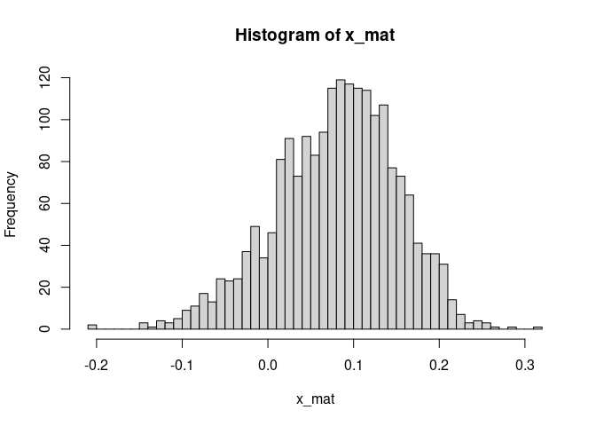
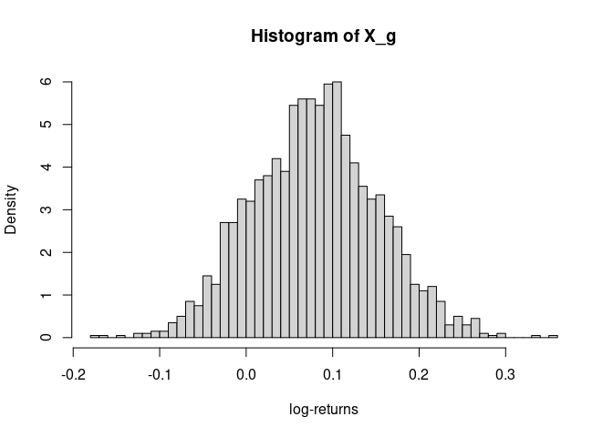
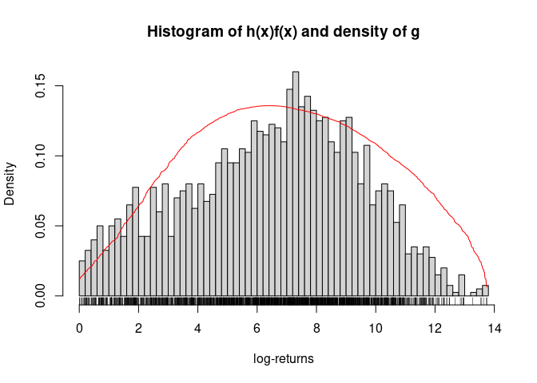
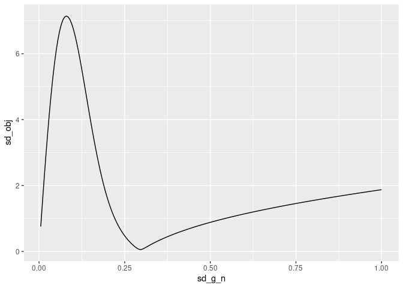
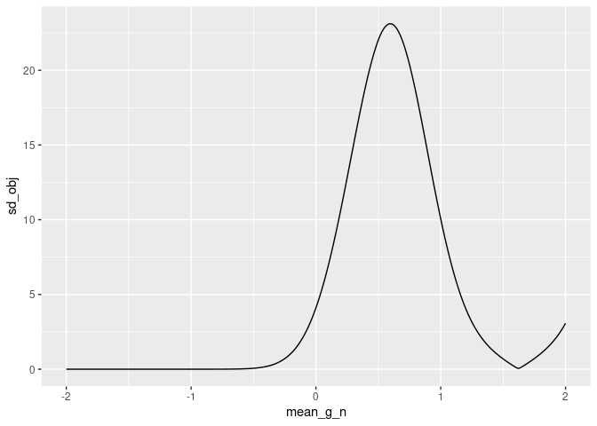
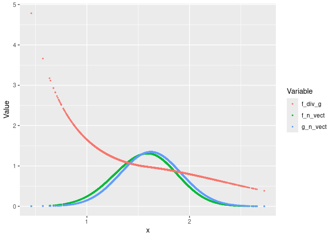
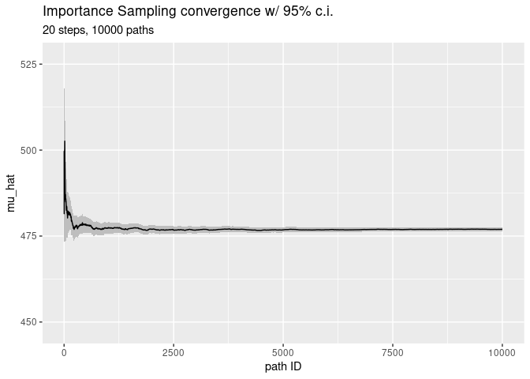
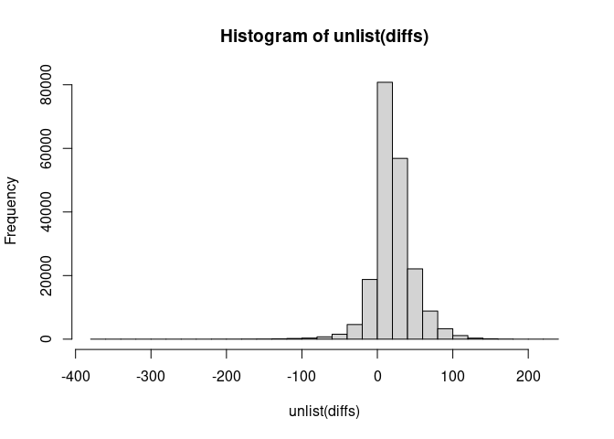

$x_k$ is a stochastic variable from whitch the $k$'th path is generated. $x_{i,k}$ is the $i$'th realization of $x_k$.  

$$\mathbf{x}_k \equiv \{x_{i,k}\}_{i=1}^n := \{\text{log-return}_{i,k}\}_{i=1}^n$$
The steps of the $k$'th path are produced by
$$\{S_{i, k}\}_{i=1}^n := \Big\{\sum_{j=1}^i x_i \Big\}_{i=1}^n  $$


$$h(\mathbf{x_k}) := \sum_{i=1}^i x_{i, k}$$
for the $k$'th path.


$f(x)$ is the densify of $x$, here a skewed student t-distribution.  

$g(z)$ is the proposed density, here a normal distribution.

$x{i,k}^g$ are values generated by $g$. 

$$E_f[h(x)] = \int h(x) f(x) dx \approx \dfrac{1}{m} \sum_{k=1}^m h(x_k) = \dfrac{1}{m} \sum_{k=1}^m \Big(\sum_{i=1}^n x_{i, k}\Big)$$
where $m$ is the number of paths, and $n$ is the number of steps in each path.


$z$ is a random variable with distribution $G(z) \equiv \int g(z)\ dz$. In other words, $\mathbf{z}_k \equiv \{z_{i,k}\}_{i=1}^n$ is generated by the quantile function $G^{-1}(p)$.

$w(z) := \dfrac{f(z)}{g(z)}$ are weights, one for each path.  

$$g^{*}(z) := \arg \min_g \text{Var}\big[ h(z) w(z) \big]$$

$$w_k^{*}(z) := \dfrac{f(z)}{g^{*}(z)}$$

$$E_g[h(z)] = \int h(z)\ w^{*}(z)\  g(z) dz \approx \dfrac{1}{m} \sum_{k=1}^m h(z_k)\ w^{*}(z) = \dfrac{1}{m} \sum_{k=1}^m \Big(\sum_{i=1}^n z_{i, k}\Big)$$


The density of $Y_1 + Y_2$ is the convolution of the densities $f_{Y_1}(\cdot)$ and $f_{Y_2}(\cdot)$.


```r
init_capital <- 100
num_periods <- 20
num_paths <- 1e2
```


```r
## Generate matrix of simulated X data
## Columns correspond to sample paths.
## num_periods is the length n of sample path.
## num_paths is the number of sample paths.
## rfunc is the random generating function, eg. runif, rnorm, etc.
## h(x) is simply log-returns, i.e. h(x) = x
x_mat_gen_sstd <- function(fit, num_periods, num_paths) {
  matrix(
    rsstd(num_periods * num_paths, fit$m, fit$s, fit$nu, fit$xi), 
    num_periods,
    num_paths, 
    byrow = FALSE
  )
}

# x_gen_func_sstd <- function(fit, num_periods = num_periods , init_capital = 100 ) {
#   init_capital * exp(cumsum(rsstd(num_prices, fit$m, fit$s, fit$nu, fit$xi))) ## Pf index values
# }

x_mat_gen <- function(num_periods, num_paths, rfunc = rsstd, ...) {
  matrix(rfunc(n = num_periods * num_paths, ...), num_periods, num_paths, byrow = FALSE)
}

# x_gen_func <- function(num_periods = num_periods, init_capital = 100, rfunc = rsstd, ...) {
#   init_capital * exp(cumsum(rfunc(...)))
# }

xg_mat_gen <- function(num_periods, num_paths, qfunc, ...) {
  num_p_vals <- num_periods * num_paths
  p_mat <- matrix(
    runif(num_periods * num_paths, 0.0, 1.0),
    num_periods, num_paths, byrow = FALSE
  )

  matrix(qfunc(p = p_mat, ...), dim(p_mat))
}

Sn <- function(x_vect) {
  sum(x_vect)
}

h_vect_gen <- function(x_mat, h_func = Sn) {
  ## For each column, apply h to the n x-values
  h_vect <- apply(x_mat, 2, h_func) ## 2 for columns
  h_vect
}
```


```r
x_mat <- x_mat_gen_sstd(
  fit = fit_mhr, 
  num_periods = num_periods, 
  num_paths = num_paths
)
```


Distribution of simulated log-returns

```r
hist(x_mat, breaks = 40)
```

<!-- -->


```r
log_ret_fit_normal <- MASS::fitdistr(x_mat, "normal")
log_ret_fit_normal
```

```
##       mean           sd     
##   0.080096908   0.070697238 
##  (0.001580838) (0.001117821)
```


```r
xg_mat <- xg_mat_gen(num_periods, num_paths, qfunc = qnorm, mean = log_ret_fit_normal$estimate[[1]], sd = log_ret_fit_normal$estimate[[2]])
```


```r
hist(xg_mat, breaks = 50, freq = FALSE, xlab = "log-returns", main = "Histogram of X_g")
```

<!-- -->


```r
h_vect <- h_vect_gen(x_mat)
f_mat <- dsstd(x_mat, mean = fit_mhr$m, sd = fit_mhr$s, nu = fit_mhr$nu, xi = fit_mhr$xi)

#x_dens_data_norm <- dnorm(log_ret_seq, mean = x_fit_normal$estimate[[1]], sd = x_fit_normal$estimate[[2]])
hxf <- t(t(f_mat) * h_vect)

hxf_fit_normal <- MASS::fitdistr(hxf, "normal")
hxf_dens_data_norm <- dnorm(sort(hxf), mean = hxf_fit_normal$estimate[[1]], sd = hxf_fit_normal$estimate[[2]])

hxf_seq <- seq(min(hxf), max(hxf), length.out = num_periods * num_paths)

hist(hxf, breaks = 50, freq = FALSE, xlab = "log-returns", main = "Histogram of h(x)f(x) and density of g")
lines(x = hxf_seq, y = hxf_dens_data_norm, col="red")
rug(hxf)
```

<!-- -->


```r
obj_func <- function(params, x_mat, h_vect, f_mat) {
  g_x_mat <- dnorm(x_mat, params[1], params[2])
  sd(h_vect * f_mat / g_x_mat)
}
```


Joint densities for each path:  

We need the self-convolution of a skewed student (or generalized) t distribution...  
See https://search.r-project.org/CRAN/refmans/bayesmeta/html/convolve.html 

We know (https://search.r-project.org/CRAN/refmans/bayesmeta/html/convolve.html) that the convolution of two normal distributions is a normal distribution with the mean and variance being the sums of the individual means and variances respectively. Let's do a quick and dirty test to see if this is true for a skewed Student t as well:


```r
params <- c(1, 2, 5, 1.5)
set.seed(1234)
x_sstd_mat <- replicate(10000, rsstd(20, mean = params[1], sd = params[2], nu = params[3], xi = params[4]))
x_sstd_sums <- apply(x_sstd_mat, 2, sum)

loglik_sstd = function(beta, x) {sum(- dsstd(x, mean = beta[1], sd = beta[2], nu = beta[3], xi = beta[4], log = TRUE))}
start = c(mean(x_sstd_sums), sd(x_sstd_sums), 3, 1)
fit_sstd = optim(start, loglik_sstd, x = x_sstd_sums)
```

```
## Warning in log(result): NaNs produced

## Warning in log(result): NaNs produced
```

```r
cat("params of terms:", params, "\n")
```

```
## params of terms: 1 2 5 1.5
```

```r
cat("params of sum:", fit_sstd$par, "\n")
```

```
## params of sum: 20.14696 8.884686 22.16386 1.223822
```


The means look about right.  
The variances:  
Is 8.88^2 = 20 * 2^2?

```r
8.884686^2
```

```
## [1] 78.93765
```
Close...

Unfortunately we only have to run the code a few times to see that $nu$ and $xi$ are not stable at all.

Can we compute the self-convolution of a skewed generalized t density function?  
A few pointers:  

- the sum of two normally distributed random variables again turns out as normally distributed (with mean and variance resulting as the sums of the original ones).
      - https://search.r-project.org/CRAN/refmans/bayesmeta/html/convolve.html  
- The distribution for independent returns over a period of time of n-days is an n-fold self-convolution of the distribution for a single day. A Student’s t-distribution (or q-Gaussian) is not self-replicating (stable) under self-convolution except in the case of an infinite number of degrees of freedom (which is a normal distribution) or for the number of degrees of freedom equal to unity (which is a Cauchy or Lorentzian distribution). Under self-convolution a Student’s t-distribution maintains the tails of the original distribution whereas the central part of the distribution changes
      - Cassidy: Describing n-day returns with Student’s t-distributions
            - https://www.sciencedirect.com/science/article/abs/pii/S0378437111002329?via%3Dihub 
  
- Expressions for $f_{\nu_1,\nu_2}$ cannot be obtained in closed form when $\nu_1$ or $\nu_2$ is an even integer.
      - Nadarajah/Dey: Convolutions of the T distribution
            - https://www.sciencedirect.com/science/article/pii/S0898122105000854
- The pdf for n-fold self-convolution can be found by brute force calculation of the convolution integrals or as the (brute force) inverse Fourier transform of the nth power of the characteristic function of the original function.  
      - Cassidy: Describing n-day returns with Student’s t-distributions
            - https://www.sciencedirect.com/science/article/abs/pii/S0378437111002329?via%3Dihub  
      - See also: S. Nadarajah, D.K. Dey, Convolutions of the T distribution, Computers and Mathematics with Applications  
- If a random variable admits a probability density function, then the characteristic function is the Fourier transform (with sign reversal) of the probability density function.  
      - https://en.wikipedia.org/wiki/Characteristic_function_(probability_theory)  
      - See https://www.researchgate.net/publication/235386908_Characteristic_function_of_the_SGT_distribution  
            - ...but the very first sentence says "probability distribution function (PDF)"... I assume they mean probability density function...  
- a key problem with moment-generating functions is that moments and the moment-generating function may not exist, as the integrals need not converge absolutely. By contrast, the characteristic function or Fourier transform always exists (because it is the integral of a bounded function on a space of finite measure), and for some purposes may be used instead.  
      - https://en.wikipedia.org/wiki/Moment-generating_function  
- See package sgt:   
      - https://search.r-project.org/CRAN/refmans/sgt/html/sgt.html  


************* AT THIS POINT WE ARE A BIT STUCK........! *************

Things to try:
- Fit n realizations of $h$ to a skewed t.  
- Figure out how to do convolution numerically.....  
- Read Fernéndez & Steel: ON BAYESIAN MODELLING OF FAT TAILS AND SKEWNESS. Maybe the section about MCMC sheds a light.....

Note:  
In the CompStat assignment we are sampling from $g_{\theta, g}$, not from $g$. And $w$ is calculated as
$$w =  f(x_g) / g_n(x_g)$$:

```r
xg_mat <- xg_gen(p_vals, theta, a, b) ## Quantile function for g density
h_vect <- h_vect_gen(xg_mat, ...)
g_dens <- apply(xg_mat, 2, function(x) {gn_1(x, theta, a, b)})
f_dens <- replicate(num_paths, (1/3.9)^num_periods)
w_star <-  f_dens / g_dens
```

So the proposal density is the joint density, not the marginal density. The marginal (inverse) distribution function is just used to generate $x_g$.


## `mhr`

$\big\{x_{n, j}:= \sum_{i=1}^n x_{j, i}\big\}_{j=1}^m$, where $\{x_i\}_{i=1}^n$ are values generated from the skewed t-distribution fitted to the observed log-returns. $m$ is the number of simulation paths.   
So $\big\{x_{n, j}\}_{j=1}^m$ is the last row of the data frame of simulation paths, where each column is a path.  
$\{z_{n, j}\}_{j=1}^m$ are the values generated by the proposed distribution $g(z)$. 

Having fit a skewed t-distribution to the observed log-returns, and generated $x_i$ values from that distribution, we need to fit a skewed t-distribution to the vector of sums, one sum for each path.  


```r
num_periods <- 20
num_paths <- 1e4
```


```r
x_n_vect <- replicate(num_paths, sum(rsstd(num_periods - 1, fit_mhr$m, fit_mhr$s, fit_mhr$nu, fit_mhr$xi))) #unlist(mc_mhr_b$mc_df[nrow(mc_mhr_b$mc_df), ])

loglik_sstd = function(beta, x) {sum(- dsstd(x, mean = beta[1], sd = beta[2], nu = beta[3], xi = beta[4], log = TRUE))}
start = c(mean(x_n_vect), sd(x_n_vect), 3, 1)
fit_x_n <- optim(start, loglik_sstd, x = x_n_vect)
```

We will try a normal distribution as our proposal distribution. Now we need to find the optimal $w$ by finding the normal distribution which gives the smallest $sd$ of $z f(z)/g(z)$.


```r
## g_n_params is a vector c(mean, sd)
## sd_mode 1: Calculate sd for each step.
## sd_mode 2: Calculate sd only for last step (1:num_paths)
importance_sampling <- function(g_n_params, num_paths, f_n_params, p_vect, sd_mode = 1) {
  h_vect <- qnorm(p_vect, g_n_params[1], g_n_params[2])
  g_n_vect <- dnorm(h_vect, g_n_params[1], g_n_params[2])
  f_n_vect <- dsstd(h_vect, f_n_params[1], f_n_params[2], f_n_params[3], f_n_params[4])
  w_star <- f_n_vect / g_n_vect
  
  if(sd_mode == 1) {  
    mu_hat <- cumsum(h_vect * w_star) / 1:num_paths ## Element wise matrix multiplication
    sigma_hat <- numeric(num_paths)
    dev <- numeric(num_paths)
    ci_l <- numeric(num_paths) ## c.i. lower
    ci_u <- numeric(num_paths) ## c.i. upper
    for(i in 1:num_paths){
      sigma_hat[i] <- sd(h_vect[1:i] * w_star[1:i]) ## sd for paths 1 thru i
      dev[i] <- 1.96 * sigma_hat[i] / sqrt(i)
    }
  } else {
    mu_hat <- sum(h_vect * w_star) / num_paths
    sigma_hat <- sd(h_vect[1:num_paths] * w_star[1:num_paths]) ## sd for paths 1 thru i
    dev <- 1.96 * sigma_hat / sqrt(num_paths)
  }
  ci_l <- mu_hat - dev
  ci_u <- mu_hat + dev
  
  list("mu_hat" = mu_hat, "h_vect" = h_vect, "g_n_vect" = g_n_vect, "f_n_vect" = f_n_vect, "sigma_hat" = sigma_hat, "CI_lower" = ci_l, "CI_upper" = ci_u, "w_star" = w_star)
}
```

First we see what `optim()`  comes up with:

```r
is_obj_func <- function(g_n_params, num_paths, f_n_params, p_vect) {
  importance_sampling(
   g_n_params, 
   num_paths, 
   f_n_params,
   p_vect, 
   sd_mode = 2
  )$sigma_hat
}
```


```r
set.seed(1411)
p_vect <- runif(num_paths, 0.0, 1.0)
```


```r
is_g_fit <- optim(c(2, 1), fn = is_obj_func, num_paths = num_paths, f_n_params = fit_x_n$par, p_vect = p_vect)
```


```r
is_g_fit$par
```

```
## [1] 1.6227031 0.2959721
```

Let's fix the `mean` parameter of $g$ and see how $\text{sd}(h f/g)$ depends on the `sd` parameter of $g$:


```r
sd_g_n <- 1:200/200
sd_obj <- unlist(lapply(
  sd_g_n,
  function(sigma) {
    is_obj_func(
      g_n_params = c(is_g_fit$par[1], sigma), 
      num_paths = num_paths, 
      f_n_params = fit_x_n$par,
      p_vect = p_vect
    )
  }
))
```


```r
sd_vect_plot <- data.frame(sd_g_n = sd_g_n, sd_obj = sd_obj)
ggplot(sd_vect_plot, aes(x = sd_g_n, y = sd_obj)) +
  geom_line()
```

<!-- -->

$\hat{\sigma} = 0.3$ found by `optim()` looks good.


Let's try the same for the `mean` parameter:


```r
mean_g_n <- (-400):400/200
sd_obj <- unlist(lapply(
  mean_g_n,
  function(mean) {
    is_obj_func(
      g_n_params = c(mean, is_g_fit$par[2]), 
      num_paths = num_paths, 
      f_n_params = fit_x_n$par,
      p_vect = p_vect
    )
  }
))
```


```r
mean_vect_plot <- data.frame(mean_g_n = mean_g_n, sd_obj = sd_obj)
ggplot(mean_vect_plot, aes(x = mean_g_n, y = sd_obj)) +
  geom_line()
```

<!-- -->

$\hat{\mu} = 1.7$ found by `optim()` looks good.


```r
is_output <- importance_sampling(
  g_n_params =  is_g_fit$par, 
  num_paths = num_paths, 
  f_n_params = fit_x_n$par, 
  p_vect = p_vect, 
  sd_mode = 1
) 
```


```r
mean_vect_plot <- data.frame(x = is_output$h_vect, p_vect = p_vect, f_n_vect = is_output$f_n_vect, g_n_vect = is_output$g_n_vect, f_div_g = is_output$f_n_vect / is_output$g_n_vect) %>% 
  arrange(p_vect) %>% 
  gather(key = "Variable", value = "Value", -c(x, p_vect))
ggplot(mean_vect_plot, aes(x = x, y = Value, color = Variable)) +
  geom_point(size = 0.5)
```

<!-- -->


```r
df_conv <- data.frame(i = 1:num_paths, mu_hat = 100 * exp(is_output$mu_hat), ci_l = 100 * exp(is_output$CI_lower), ci_u = 100 * exp(is_output$CI_upper))
ggplot(df_conv, aes(x = i, y = mu_hat)) + 
geom_ribbon(
  mapping = aes(
    ymin = ci_l, 
    ymax = ci_u
  ), fill = "gray") +
ylim(min(is_output$CI_lower), max(is_output$CI_upper)) +
geom_line() + 
labs(title = paste("Importance Sampling convergence w/ 95% c.i."), subtitle = paste(num_periods, "steps,", num_paths, "paths"), x = "path ID", y = "mu_hat")
```

<!-- -->

This looks good, the implementation seems to work. The estimate matches the MC estimate. But it doesn't seem very useful. In the present case $h(x) := x$, so $f(x)$ is the distribution of $h(x)$. The purpose of the importance sampling is to determine the parameters of the distribution of $h(x)$, but we already know the parameters of $f$, because we used them to simulate the data. But it does visualize how well the estimate converges.

One issue with the implementation (ignoring the fact that it is not useful) is that the confidence intervals need some work. Does the confidence interval say anything about the probability, that the true mean is in the confidence interval?

Another thing to note is, that we need to estimate the density of x_n. So IS doesn't offer a performance advantage over MC in this case. Otherwise we would need to know the theoretical distribustion of the x_n's, which is the problem of convolution mentioned above. However, once we have estimated the parameters of g (which can be a very slow process with `optim()`), the IS itself is super fast.


# Notes

Some thoughts...  
Portfolio index value diffs are path dependent. For instance a diff of 100 is very unlikely, if the previous index value is 5. But if the previous value is 1000, a diff of 100 is quite likely.

So instead of making an MC simulation of diffs, we should make a simulation of log-returns. From that we can then calculate and plot paths of index values.


If the columns in `x_mat` are vectors of portfolio index value differences:


```r
diffs <- lapply(mc_mhr_b$mc_df, diff)
```


*** FIX ***
Here were are looking at the hist of $h$, but we should look at $h(x)\cdots f(x)$. We 


```r
hist(unlist(diffs), breaks = 40)
```

<!-- -->

Even though the distribution is visibly skewed, we use a normal distribution as $g(x)$. This is because it is very easy to fit a symmetric normal distribution with `fitdistr()`. Also the thin tails should offer the benefit of not down weighting the tails as much.


```r
diffs_fit_normal <- MASS::fitdistr(unlist(diffs), "normal")
diffs_fit_normal
```

```
##       mean           sd     
##   21.02135780   26.57844316 
##  ( 0.05943121) ( 0.04202421)
```


```r
diffs_seq <- min(unlist(diffs)):max(unlist(diffs))
diffs_dens_data_norm <- dnorm(diffs_seq, mean = diffs_fit_normal$estimate[[1]], sd = diffs_fit_normal$estimate[[2]])

hist(unlist(diffs), breaks = 50, freq = FALSE, xlab = "diffs", main = "Density and histogram of diffs")
lines(x = diffs_seq, y = diffs_dens_data_norm, col="red")
rug(unlist(diffs))
```

<!-- -->


Possible issue:  
The smallest value we will be deviding by is 1.212415e-29:

```r
min(diffs_dens_data_norm)
```

```
## [1] 5.141632e-48
```

But we should try to minimize the sd of $h\cdot f/g^{*} \equiv h \cdot w^{*}$ wrt. the sd of the proposal distribution $g$

What happens if we use the distribution of $h \cdot f$ as $g$?  

$$\int \dfrac{h(x) f(x)}{h(x) f(x)}dx = \int 1 dx = x$$


