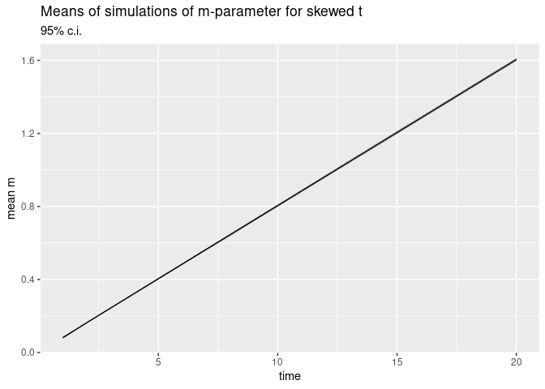
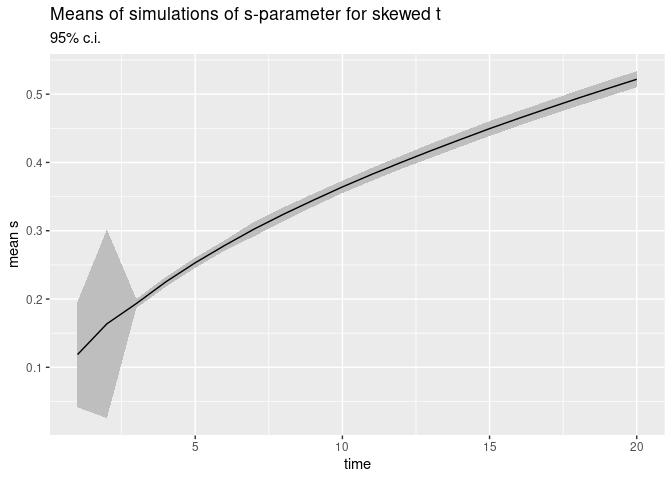
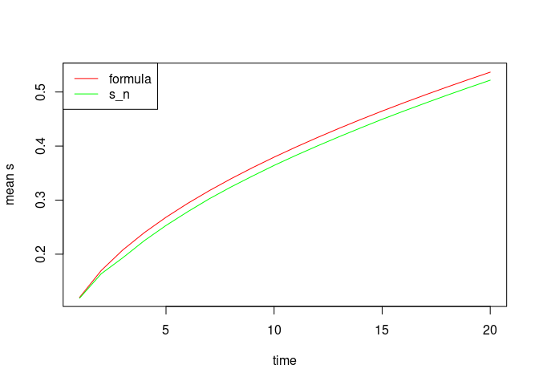
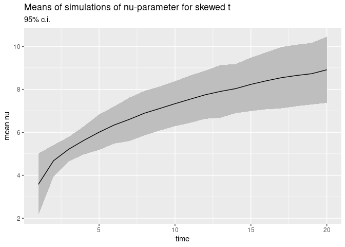
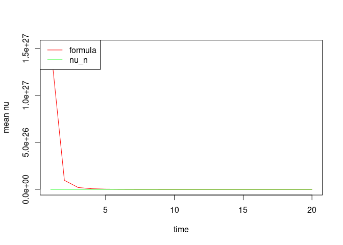
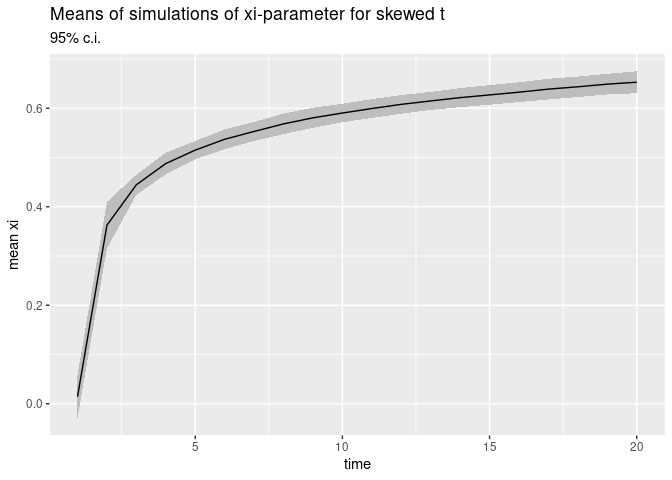
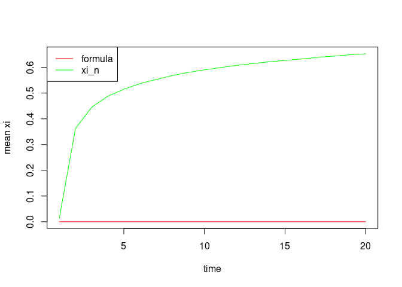

```r
params_for_sums <- readRDS(file="params_for_sums.RData")
```


 	  m 	    s 	        nu 	      xi
m 	1.605 	7060.920 	  320.586 	0.02
s 	0.005 	85.209 	    67.491 	  0.14


```r
params_for_sums_summary <-  readRDS(file="params_for_sums_summary.RData")
knitr::kable(params_for_sums_summary, digits = 3)
```


|   |     m|        s|      nu|   xi|
|:--|-----:|--------:|-------:|----:|
|m  | 1.605| 7060.920| 320.586| 0.02|
|s  | 0.005|   85.209|  67.491| 0.14|


```r
num_simulations <- 100
num_paths <- 10000
num_periods <- 20
params <- c(0.08, 0.12, 3.18, 0.02)
```


```r
params_for_cum_sums_summary <- readRDS(file="params_for_cum_sums_summary.RData")
```


```r
ggplot(params_for_cum_sums_summary, aes(x = 1:20, y = m_mean)) +
  geom_ribbon(
      mapping = aes(
        ymin = m_ci_l, 
        ymax = m_ci_u
      ), fill = "gray") +
  geom_line() +
  labs(title = "Means of simulations of m-parameter for skewed t", subtitle = "95% c.i.", x = "time", y = "mean m")
```

<!-- -->
This looks like:

$$m(n) = n \cdot m(0)$$


```r
formula_m <- data.frame(m_n = 1:20 * params[1])
m_n <- params_for_cum_sums_summary$m_mean
compare_m_n <- t(cbind(formula_m, m_n))
rownames(compare_m_n) <- c("formula", "m_n")
knitr::kable(compare_m_n, digits = 3)
```


|        |      |      |      |      |      |      |      |      |      |      |      |      |      |      |      |      |      |      |      |      |
|:-------|-----:|-----:|-----:|-----:|-----:|-----:|-----:|-----:|-----:|-----:|-----:|-----:|-----:|-----:|-----:|-----:|-----:|-----:|-----:|-----:|
|formula | 0.080| 0.160| 0.240| 0.320| 0.400| 0.480| 0.560| 0.640| 0.720| 0.800| 0.880| 0.960| 1.040| 1.120| 1.200| 1.280| 1.360| 1.440| 1.520| 1.600|
|m_n     | 0.081| 0.163| 0.243| 0.324| 0.404| 0.484| 0.564| 0.644| 0.724| 0.804| 0.885| 0.965| 1.045| 1.125| 1.205| 1.285| 1.365| 1.445| 1.525| 1.605|

```r
plot(1:20, compare_m_n[1, ], type = "l", col = "red", xlab = "time", ylab = "mean m", lwd = 3)
lines(compare_m_n[2, ], col = "green", lwd = 1.5, lty = 2)
legend("topleft", c("formula", "m_n"), col = c("red", "green"), lty = c(1, 2), lwd = c(3, 1.5))
```

<!-- -->


```r
ggplot(params_for_cum_sums_summary, aes(x = 1:20, y = s_mean)) +
  geom_ribbon(
      mapping = aes(
        ymin = s_ci_l, 
        ymax = s_ci_u
      ), fill = "gray") +
  geom_line() +
  labs(title = "Means of simulations of s-parameter for skewed t", subtitle = "95% c.i.", x = "time", y = "mean s")
```

<!-- -->
This looks like:

$$s(n) = \sqrt{n s(1)^2}$$


```r
formula_s <- data.frame(s_n = sqrt(1:20 * params[2]^2))
s_n <- params_for_cum_sums_summary$s_mean
compare_s_n <- t(cbind(formula_s, s_n))
rownames(compare_s_n) <- c("formula", "s_n")
knitr::kable(compare_s_n, digits = 3)
```


|        |      |      |      |      |      |      |      |      |      |      |      |      |      |      |      |      |      |      |      |      |
|:-------|-----:|-----:|-----:|-----:|-----:|-----:|-----:|-----:|-----:|-----:|-----:|-----:|-----:|-----:|-----:|-----:|-----:|-----:|-----:|-----:|
|formula | 0.120| 0.170| 0.208| 0.240| 0.268| 0.294| 0.317| 0.339| 0.360| 0.379| 0.398| 0.416| 0.433| 0.449| 0.465| 0.480| 0.495| 0.509| 0.523| 0.537|
|s_n     | 0.119| 0.164| 0.193| 0.225| 0.253| 0.278| 0.302| 0.324| 0.345| 0.364| 0.383| 0.400| 0.417| 0.433| 0.450| 0.465| 0.480| 0.494| 0.508| 0.522|


```r
plot(1:20, compare_s_n[1, ], type = "l", col = "red", xlab = "time", ylab = "mean s")
lines(compare_s_n[2, ], col = "green")
legend("topleft", c("formula", "s_n"), col = c("red", "green"), lty = 1)
```

<!-- -->


```r
ggplot(params_for_cum_sums_summary, aes(x = 1:20, y = nu_mean)) +
  geom_ribbon(
      mapping = aes(
        ymin = nu_ci_l, 
        ymax = nu_ci_u
      ), fill = "gray") +
  geom_line() +
  labs(title = "Means of simulations of nu-parameter for skewed t", subtitle = "95% c.i.", x = "time", y = "mean nu")
```

<!-- -->

We don't have a good guess here:


```r
formula_nu <- data.frame(nu_n = (1:20 * params[4]^4)^(-4))
nu_n <- params_for_cum_sums_summary$nu_mean
compare_nu_n <- t(cbind(formula_nu, nu_n))
rownames(compare_nu_n) <- c("formula", "nu_n")
knitr::kable(compare_nu_n, digits = 3)
```


|        |             |             |             |             |             |             |             |            |            |             |             |             |             |             |             |             |            |            |             |             |
|:-------|------------:|------------:|------------:|------------:|------------:|------------:|------------:|-----------:|-----------:|------------:|------------:|------------:|------------:|------------:|------------:|------------:|-----------:|-----------:|------------:|------------:|
|formula | 1.525879e+27| 9.536743e+25| 1.883801e+25| 5.960464e+24| 2.441406e+24| 1.177376e+24| 6.355181e+23| 3.72529e+23| 2.32568e+23| 1.525879e+23| 1.042196e+23| 7.358598e+22| 5.342526e+22| 3.971988e+22| 3.014082e+22| 2.328306e+22| 1.82694e+22| 1.45355e+22| 1.170862e+22| 9.536743e+21|
|nu_n    | 3.575000e+00| 4.677000e+00| 5.213000e+00| 5.626000e+00| 6.005000e+00| 6.342000e+00| 6.604000e+00| 6.89400e+00| 7.11000e+00| 7.333000e+00| 7.543000e+00| 7.750000e+00| 7.906000e+00| 8.035000e+00| 8.233000e+00| 8.396000e+00| 8.54300e+00| 8.64600e+00| 8.729000e+00| 8.912000e+00|


```r
plot(1:20, compare_nu_n[1, ], type = "l", col = "red", xlab = "time", ylab = "mean nu")
lines(compare_nu_n[2, ], col = "green")
legend("topleft", c("formula", "nu_n"), col = c("red", "green"), lty = 1)
```

<!-- -->


```r
ggplot(params_for_cum_sums_summary, aes(x = 1:20, y = xi_mean)) +
  geom_ribbon(
      mapping = aes(
        ymin = xi_ci_l, 
        ymax = xi_ci_u
      ), fill = "gray") +
  geom_line() +
  labs(title = "Means of simulations of xi-parameter for skewed t", subtitle = "95% c.i.", x = "time", y = "mean xi")
```

<!-- -->

Again, no good guess:

```r
formula_xi <- data.frame(xi_n = (1:20 * params[3]^3)^(-3))
xi_n <- params_for_cum_sums_summary$xi_mean
compare_xi_n <- t(cbind(formula_xi, xi_n))
rownames(compare_xi_n) <- c("formula", "xi_n")
knitr::kable(compare_xi_n, digits = 3)
```


|        |      |      |      |      |      |      |      |      |      |     |      |      |      |      |      |      |      |      |      |      |
|:-------|-----:|-----:|-----:|-----:|-----:|-----:|-----:|-----:|-----:|----:|-----:|-----:|-----:|-----:|-----:|-----:|-----:|-----:|-----:|-----:|
|formula | 0.000| 0.000| 0.000| 0.000| 0.000| 0.000| 0.000| 0.000| 0.000| 0.00| 0.000| 0.000| 0.000| 0.000| 0.000| 0.000| 0.000| 0.000| 0.000| 0.000|
|xi_n    | 0.014| 0.363| 0.445| 0.488| 0.515| 0.537| 0.553| 0.568| 0.581| 0.59| 0.599| 0.608| 0.615| 0.622| 0.627| 0.633| 0.639| 0.644| 0.649| 0.653|


```r
plot(1:20, compare_xi_n[1, ], type = "l", col = "red", xlab = "time", ylab = "mean xi", ylim = c(0, max(c(compare_xi_n[1, ], compare_xi_n[2, ]))))
lines(compare_xi_n[2, ], col = "green")
legend("topleft", c("formula", "xi_n"), col = c("red", "green"), lty = 1)
```

<!-- -->


