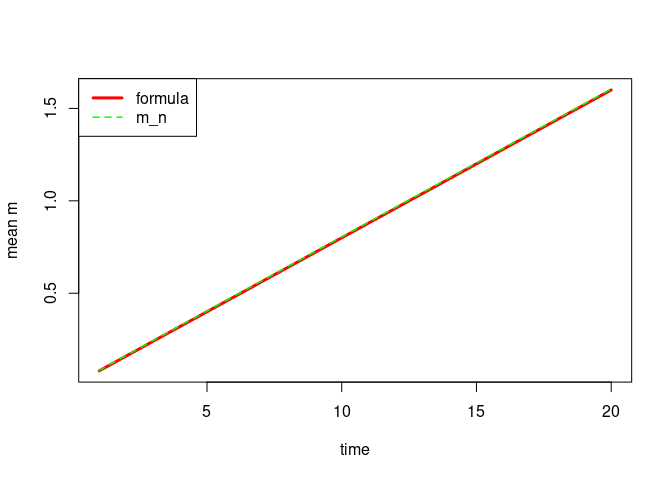

# Estimating the parameters of a sum skewed $t$ distributed r.v's


```r
num_simulations <- 1000
num_paths <- 10000
num_periods <- 20
sim_params <- c(0.08, 0.12, 3.18, 0.02)
```


Estimated parameters for sum, $S_{20}$:


|   |     m|     s|    nu|    xi|
|:--|-----:|-----:|-----:|-----:|
|m  | 1.605| 0.522| 8.856| 0.653|
|s  | 0.005| 0.006| 0.846| 0.011|


```r
num_simulations <- 100
num_paths <- 10000
num_periods <- 20
sim_params <- c(0.08, 0.12, 3.18, 0.02)
```


## Estimating the $m$ parameter of the skewed $t$ distribution


<!-- -->

This looks like:

$$m(n) = n \cdot m(0)$$


|        |     1|     2|     3|     4|     5|     6|     7|     8|     9|    10|
|:-------|-----:|-----:|-----:|-----:|-----:|-----:|-----:|-----:|-----:|-----:|
|formula | 0.080| 0.160| 0.240| 0.320| 0.400| 0.480| 0.560| 0.640| 0.720| 0.800|
|m_n     | 0.081| 0.163| 0.243| 0.324| 0.404| 0.484| 0.564| 0.644| 0.725| 0.805|


|        |    11|    12|    13|    14|    15|    16|    17|    18|    19|    20|
|:-------|-----:|-----:|-----:|-----:|-----:|-----:|-----:|-----:|-----:|-----:|
|formula | 0.880| 0.960| 1.040| 1.120| 1.200| 1.280| 1.360| 1.440| 1.520| 1.600|
|m_n     | 0.885| 0.965| 1.045| 1.125| 1.205| 1.285| 1.365| 1.446| 1.526| 1.606|


<!-- -->


### Verify $m(n) = n \cdot m(0)$

Test if the sample means of a sum of F-S Skewed $t$ r.v.'s are equal to $n$ times the mean of a single r.v. from that distribution.

Even with only 50 samples to estimate the sample mean, the fit is spot on.


```r
num_sim <- 50
n <- 100
mu <- 1.7
sigma <-  2
nu <- 3
xi <- 0.25
```


<!-- -->


## Estimating the $s$ parameter of the skewed $t$ distribution

<!-- -->

This looks like:

$$s(n) = \sqrt{n s(1)^2}$$


|        |     1|     2|     3|     4|     5|     6|     7|     8|     9|    10|
|:-------|-----:|-----:|-----:|-----:|-----:|-----:|-----:|-----:|-----:|-----:|
|formula | 0.120| 0.170| 0.208| 0.240| 0.268| 0.294| 0.317| 0.339| 0.360| 0.379|
|s_n     | 0.115| 0.158| 0.194| 0.226| 0.253| 0.279| 0.302| 0.324| 0.345| 0.364|


|        |    11|    12|    13|    14|    15|    16|    17|    18|    19|    20|
|:-------|-----:|-----:|-----:|-----:|-----:|-----:|-----:|-----:|-----:|-----:|
|formula | 0.398| 0.416| 0.433| 0.449| 0.465| 0.480| 0.495| 0.509| 0.523| 0.537|
|s_n     | 0.382| 0.400| 0.417| 0.433| 0.449| 0.464| 0.479| 0.493| 0.507| 0.520|

<!-- -->

Let's use that (according to Taleb, ch. 8)
$$\mathbb{M}(n) = n^{1/\tilde{\alpha}} \mathbb{M}(1) = n^{1/\tilde{\alpha}}\sqrt{\dfrac{2}{\pi}} \sigma$$
where

$$\tilde{\alpha} = \alpha I\{\alpha < 0\} + 2 I\{\alpha < \geq 0\}$$
for the Power Law class and otherwise

$$\tilde{\alpha} = 2$$


We'll implement this as formula 1.

Let formula 2 be:
$$\mathbb{M}(n) = \dfrac{\sum_k^m \lvert S_{n, k} - n \mu_{X_i} \rvert}{n}$$
where $\mu_{X_i}$ is the location parameter we use to generate $\{X_i\}$, and $S_{n, k}$, is the sum of $X_{k,1}, X_{k,2}, \dots, X_{k,n}$ for the $k$'th simulation.


```r
num_simulations <- 1000
num_paths <- 10000
num_periods <- 20
sim_params <- c(0.08, 0.12, 3.18, 0.02)
```


|    |      1|      2|      3|      4|      5|      6|      7|      8|      9|     10|
|:---|------:|------:|------:|------:|------:|------:|------:|------:|------:|------:|
|f1  | 0.0957| 0.1191| 0.1353| 0.1481| 0.1588| 0.1682| 0.1766| 0.1841| 0.1911| 0.1975|
|f2  | 0.0743| 0.1119| 0.1413| 0.1662| 0.1883| 0.2084| 0.2268| 0.2441| 0.2602| 0.2755|
|s_n | 0.0743| 0.1119| 0.1413| 0.1662| 0.1883| 0.2083| 0.2268| 0.2440| 0.2602| 0.2755|


|    |     11|     12|     13|     14|     15|    16|     17|     18|     19|     20|
|:---|------:|------:|------:|------:|------:|-----:|------:|------:|------:|------:|
|f1  | 0.2035| 0.2092| 0.2145| 0.2196| 0.2244| 0.229| 0.2334| 0.2376| 0.2417| 0.2456|
|f2  | 0.2902| 0.3041| 0.3176| 0.3305| 0.3429| 0.355| 0.3667| 0.3781| 0.3892| 0.3999|
|s_n | 0.2901| 0.3041| 0.3175| 0.3304| 0.3429| 0.355| 0.3667| 0.3780| 0.3891| 0.3999|


<!-- -->

Formula 2 matches the realized MAD of $\{S_{n, k}\}_k^m$ very well.  
Formula 1 matches the realized MAD of $\{S_{n, k}\}_k^m$ very badly.

We notice that:

$$\sqrt{\dfrac{2}{\pi}} \sigma_{X_i} = 0.09575$$

$$\sqrt{\dfrac{2}{\pi}} \hat{\sigma}_{X_i} = \text{approx.} 0.09$$


```r
sd(rsstd(1e5, 
         mean = sim_params[1], sd = sim_params[2], nu = sim_params[3], xi = sim_params[4])
   ) * sqrt(2/pi)
```

```
## [1] 0.09330654
```


while

$$\mathbb{M}(1) =\dfrac{\sum_{k=1}^m \lvert X_{k, i} - n \overline{X_i} \rvert}{m} = \text{approx.} 0.07$$


```r
f_mad(rsstd(1e5, mean = sim_params[1], sd = sim_params[2], nu = sim_params[3], xi = sim_params[4]))
```

```
## [1] 0.07448496
```

But are we supposed to see that

$$\mathbb{M}(1) =\sqrt{\dfrac{2}{\pi}} \sigma$$

??

Actually no:  

The relation $\mathbb{M}^{\nu}(1) = \sqrt{\frac{2}{\pi}} \sigma$ only holds for the standard normal distribution, and only asymptotically. The ratio $\frac{\text{MAD}(X)}{\text{sd}(X)}$ varies between 0 and 1.

https://en.wikipedia.org/wiki/Average_absolute_deviation#Mean_absolute_deviation_around_the_mean 

For a Student $t$ with 3 df, the ratio is $\frac{\pi}{2}$. (See Taleb ch. 4 for further discussion.)


```r
sd(rsstd(1e5, mean = sim_params[1], sd = sim_params[2], nu = sim_params[3], xi = sim_params[4])) * 2/pi
```

```
## [1] 0.0758978
```

That's better!

So let's use this ratio instead:


|    |      1|      2|      3|      4|      5|      6|      7|      8|      9|     10|
|:---|------:|------:|------:|------:|------:|------:|------:|------:|------:|------:|
|f1  | 0.0764| 0.1080| 0.1323| 0.1528| 0.1708| 0.1871| 0.2021| 0.2161| 0.2292| 0.2416|
|f2  | 0.0743| 0.1119| 0.1413| 0.1662| 0.1883| 0.2084| 0.2268| 0.2441| 0.2602| 0.2755|
|s_n | 0.0743| 0.1119| 0.1413| 0.1662| 0.1883| 0.2083| 0.2268| 0.2440| 0.2602| 0.2755|


|    |     11|     12|     13|     14|     15|     16|     17|     18|     19|     20|
|:---|------:|------:|------:|------:|------:|------:|------:|------:|------:|------:|
|f1  | 0.2534| 0.2646| 0.2754| 0.2858| 0.2959| 0.3056| 0.3150| 0.3241| 0.3330| 0.3416|
|f2  | 0.2902| 0.3041| 0.3176| 0.3305| 0.3429| 0.3550| 0.3667| 0.3781| 0.3892| 0.3999|
|s_n | 0.2901| 0.3041| 0.3175| 0.3304| 0.3429| 0.3550| 0.3667| 0.3780| 0.3891| 0.3999|


<!-- -->

Now formula 1 matches the realized MAD of $\{S_{n, k}\}_k^m$ better, but still not very well.  
Formula 2 is the way to go.

See "taleb_kappa.pdf" for further discussion.


## Estimating the $\nu$ parameter of the skewed $t$ distribution

<!-- -->

We don't have a good guess here.


## Estimating the $\xi$ parameter of the skewed $t$ distribution

<!-- -->

Again, no good guess.


## Analytical m and s from $\alpha$

According to Taleb, the better way to estimate dispersion is to estimate the tail parameter using MLE and then computing the analytical mean and standard deviation as a function of $\nu$.

### Analytical moments  

According to `help(std)`, you obtain `sd(rt())` by `sd() / sqrt(nu / (nu - 2))`.  

So this should give sd of 1:


<!-- -->


<!-- -->


```r
df = 30
x_rt <- ((rt(n = 1e6, df = df) * sqrt((df - 2) / df)) * 0.9 + 0.4) 
x_std <- rsstd(n = 1e6, mean = 0.4, sd = 0.9, nu = df)
x_sstd <- rsstd(n = 1e6, mean = 0.4, sd = 0.9, nu = df, xi = 0.2)
```


```r
mean(x_rt)
```

```
## [1] 0.3999944
```

```r
mean(x_std)
```

```
## [1] 0.4004414
```

```r
mean(x_sstd)
```

```
## [1] 0.3999329
```


```r
sd(x_rt)
```

```
## [1] 0.8993699
```

```r
sd(x_std)
```

```
## [1] 0.9008423
```

```r
sd(x_sstd)
```

```
## [1] 0.8993905
```

The mean seems fine for all `df > 2`:


<!-- -->

For less than approx. 3 df (nu) it doesn't hold:


<!-- -->


<!-- -->


<!-- -->


### Analytical mean


"A review of Student’s t distribution and its generalizations.pdf", p. 10

$$
f(x) = \dfrac{2 \xi}{\xi^2 + 1}\dfrac{\Gamma\left(\frac{\nu + 1}{2}\right)}{\sqrt{\pi \nu} \Gamma\left(\frac{\nu}{2}\right)} \left[ 1 + \dfrac{x^2}{\nu}\left(\dfrac{1}{\xi^2}I\{x \geq 0\} + \xi^2 I\{x<0\} \right)\right]^{-\frac{\nu + 1}{2}}
$$

$$
\mathbb{E}[X^r] = M_r \dfrac{\xi^{r+1} + \frac{(-1)^r}{\xi^{r+1}}}{\xi+\frac{1}{\xi}}
$$
where

$$
M_r = \int_0^{\infty}2 x^r f(x) dx
$$


```
## Input mean param: 0.08
```

```
## Analytical mean param:
```

```
## $value
## [1] -0.0008603894
## 
## $integration.abs.error
## [1] 2.295918e-05
```

fGarch vignette:


```
## Input mean param: 0.08
```

```
## Analytical mean param:
```

```
## [1] 4.932924e-05
```


### Analytical sd

"A review of Student’s t distribution and its generalizations"

(See above)


```
## Input sd param: 0.12
```

```
## Analytical sd param:
```

```
## $value
## [1] 0.002153768
## 
## $integration.abs.error
## [1] 9.062533e-07
```


fGarch vignette:  
"Parameter Estimation of ARMA Models with GARCH/APARCH Errors An R and SPlus Software Implementation", p. 12

$$
f(x \mid \xi) = \dfrac{2}{\xi + \frac{1}{\xi}} \left[f(\xi x) I\{x \geq 0\} + f\left(\dfrac{x}{\xi}\right) I\{x<0\} \right]
$$
$$
\mu_{\xi} = M_1 \left( \xi - \dfrac{1}{\xi} \right)
$$
$$
\sigma_{\xi}^2 = (M_2 - M_1^2)\left(\xi^2 + \dfrac{1}{\xi^2} \right) + 2 M_1^2 - M_2
$$
where $M_r$ is defined as above.


```
## Input sd param: 0.12
```

```
## Analytical sd param:
```

```
## [1] 7.936333e-06
```


## Convergence


```r
num_simulations <- 100
n_exponent <- 15
sim_params <- c(0.08, 0.12, 3.18, 0.02)
sim_data <- replicate(num_simulations, rsstd(2^n_exponent, sim_params[1], sim_params[2], sim_params[3], sim_params[4]))
```

Simulate parameter estimation


<!-- -->


<!-- -->


<!-- -->


### Compare estimation packages


```r
num_simulations <- 100
n_exponent <- 13
sim_params <- c(0.058, 0.123, 2.265, 0.477) ## pmr
sim_data <- as.data.frame(replicate(num_simulations, rsstd(2^n_exponent, sim_params[1], sim_params[2], sim_params[3], sim_params[4])))
```


```
## Warning: Removed 108 rows containing non-finite outside the scale range
## (`stat_boxplot()`).
```

```
## Warning: Removed 108 rows containing missing values or values outside the scale range
## (`geom_point()`).
```

<!-- -->


```
## Warning: Removed 8 rows containing missing values or values outside the scale range
## (`geom_line()`).
```

<!-- -->


```
## Warning: Removed 108 rows containing non-finite outside the scale range
## (`stat_boxplot()`).
```

```
## Warning: Removed 108 rows containing missing values or values outside the scale range
## (`geom_point()`).
```

<!-- -->


```
## Warning: Removed 8 rows containing missing values or values outside the scale range
## (`geom_line()`).
```

<!-- -->


```
## Warning: Removed 108 rows containing non-finite outside the scale range
## (`stat_boxplot()`).
```

```
## Warning: Removed 108 rows containing missing values or values outside the scale range
## (`geom_point()`).
```

<!-- -->


```
## Warning: Removed 8 rows containing missing values or values outside the scale range
## (`geom_line()`).
```

<!-- -->


(No boxplot for xi, because fitdistr fits to a t-distribution, i.e. no xi parameter.)


```
## Warning in max(ids, na.rm = TRUE): no non-missing arguments to max; returning
## -Inf
```

```
## Warning: Removed 11 rows containing missing values or values outside the scale range
## (`geom_line()`).
```

```
## Warning in max(ids, na.rm = TRUE): no non-missing arguments to max; returning
## -Inf
```

```
## Warning: Removed 7 rows containing missing values or values outside the scale range
## (`geom_line()`).
```

<!-- -->


```r
##########################
## Data object dimensions:
##########################
##
## sim_data: 2^n_exponent x num_simulations  
## hat_vals: num_simulations x n_exponent  
## hat_stats: n_exponent x 5 (n, mean, sd, ci_l, ci_u)  
## package_df: 
## packages_comparison_list: 
##   n_exponent lists containing 1 data frame for each package:
##     each data frame: num_simulations x 4 ("m", "s", "nu", "xi")
##
## hat_vals_list:
##   list of 4 lists, one list for each of ("m", "s", "nu", "xi")
##     list of 3 data frames, one for each package
##       hat_vals data frames: num_simulations x n_exponent
##
## packages_comparison_stats_list: 
##   list of 4 lists, one list for each of ("m", "s", "nu", "xi")
##     list of 3 data frames - with hat_stats(hat_vals)
##       each data frame (hat_stats): n_exponent x 5 (n as factor, m, sd, ci_l, ci_u)
##
## From each hat_stats df, make hat_stats_plot
##
## packages_comparison_stats_list_for_plot:
##   list of 4 data frames, one for each of ("m", "s", "nu", "xi"): 
##     packages_comparison_stats_df: 3 * n_exponent x 6 (n as factor, m, sd, ci_l, ci_u, package)
```


