Fit log returns to F-S skew standardized Student-t distribution.  
`m`  is the location parameter.  
`s` is the scale parameter.  
`nu` is the estimated shape parameter (degrees of freedom).  
`xi` is the estimated skewness parameter.  

# Returns data 2011-2023.  

For 2011, medium risk data is used in the high risk data set, as no high risk fund data is available prior to 2012.  
`vmrl` is a long version of Velliv medium risk data, from 2007 to 2023. For 2007 to 2011 (both included) no high risk data is available.


<!-- -->


## Summary of log-returns

The summary statistics are transformed back to the scale of gross returns by taking $exp()$ of each summary statistic. (Note: Taking arithmetic mean of gross returns directly is no good. Must be geometric mean.)


|         |   vmr|   vhr|  vmrl|   pmr|   phr|   mmr|   mhr| vmr_phr| vhr_pmr|
|:--------|-----:|-----:|-----:|-----:|-----:|-----:|-----:|-------:|-------:|
|Min.   : | 0.868| 0.849| 0.801| 0.904| 0.878| 0.988| 0.977|   0.979|   0.967|
|1st Qu.: | 1.044| 1.039| 1.013| 1.042| 1.068| 1.013| 1.013|   1.021|   1.011|
|Median : | 1.097| 1.099| 1.085| 1.084| 1.128| 1.085| 1.113|   1.102|   1.094|
|Mean   : | 1.067| 1.080| 1.057| 1.063| 1.089| 1.064| 1.085|   1.079|   1.072|
|3rd Qu.: | 1.136| 1.160| 1.128| 1.107| 1.182| 1.101| 1.128|   1.121|   1.107|
|Max.   : | 1.168| 1.214| 1.193| 1.141| 1.208| 1.133| 1.207|   1.178|   1.163|


## Ranking

| Min.   :|ranking | 1st Qu.:|ranking | Median :|ranking | Mean   :|ranking | 3rd Qu.:|ranking | Max.   :|ranking |
|--------:|:-------|--------:|:-------|--------:|:-------|--------:|:-------|--------:|:-------|--------:|:-------|
|    0.988|mmr     |    1.068|phr     |    1.128|phr     |    1.089|phr     |    1.182|phr     |    1.214|vhr     |
|    0.979|vmr_phr |    1.044|vmr     |    1.113|mhr     |    1.085|mhr     |    1.160|vhr     |    1.208|phr     |
|    0.977|mhr     |    1.042|pmr     |    1.102|vmr_phr |    1.080|vhr     |    1.136|vmr     |    1.207|mhr     |
|    0.967|vhr_pmr |    1.039|vhr     |    1.099|vhr     |    1.079|vmr_phr |    1.128|vmrl    |    1.193|vmrl    |
|    0.904|pmr     |    1.021|vmr_phr |    1.097|vmr     |    1.072|vhr_pmr |    1.128|mhr     |    1.178|vmr_phr |
|    0.878|phr     |    1.013|vmrl    |    1.094|vhr_pmr |    1.067|vmr     |    1.121|vmr_phr |    1.168|vmr     |
|    0.868|vmr     |    1.013|mmr     |    1.085|vmrl    |    1.064|mmr     |    1.107|pmr     |    1.163|vhr_pmr |
|    0.849|vhr     |    1.013|mhr     |    1.085|mmr     |    1.063|pmr     |    1.107|vhr_pmr |    1.141|pmr     |
|    0.801|vmrl    |    1.011|vhr_pmr |    1.084|pmr     |    1.057|vmrl    |    1.101|mmr     |    1.133|mmr     |


## Correlations and covariance

Correlations

|    |    vmr|    vhr|    pmr|    phr|
|:---|------:|------:|------:|------:|
|vmr |  1.000|  0.993| -0.197| -0.095|
|vhr |  0.993|  1.000| -0.119| -0.016|
|pmr | -0.197| -0.119|  1.000|  0.957|
|phr | -0.095| -0.016|  0.957|  1.000|

Covariances

|    |    vmr|    vhr|    pmr|    phr|
|:---|------:|------:|------:|------:|
|vmr |  0.007|  0.009| -0.001| -0.001|
|vhr |  0.009|  0.011| -0.001|  0.000|
|pmr | -0.001| -0.001|  0.004|  0.007|
|phr | -0.001|  0.000|  0.007|  0.011|


# Compare pension plans

## Risk of loss

Risk of loss at least as big as row name in percent for a single period (year).

Skewed $t$-distribution (sstd):  


|   |    vmr|    vhr|    pmr|    phr|    mmr|    mhr| vmr_phr| vhr_pmr|
|:--|------:|------:|------:|------:|------:|------:|-------:|-------:|
|0  | 21.167| 21.333| 11.833| 14.000| 12.333| 12.667|  16.667|  16.000|
|5  | 12.167| 13.167|  5.667|  8.333|  5.833|  3.833|   8.667|   8.167|
|10 |  7.000|  8.000|  3.000|  5.000|  2.833|  0.500|   4.333|   4.167|
|25 |  1.333|  1.500|  0.500|  1.000|  0.333|  0.000|   0.333|   0.333|
|50 |  0.000|  0.000|  0.000|  0.000|  0.000|  0.000|   0.000|   0.000|
|90 |  0.000|  0.000|  0.000|  0.000|  0.000|  0.000|   0.000|   0.000|
|99 |  0.000|  0.000|  0.000|  0.000|  0.000|  0.000|   0.000|   0.000|


Standardized $t$-distribution (std):  


|   |    vmr|    vhr|   pmr|    phr|    mmr|    mhr| vmr_phr| vhr_pmr|
|:--|------:|------:|-----:|------:|------:|------:|-------:|-------:|
|0  | 17.333| 20.333| 8.833| 26.667| 11.667| 14.333|  13.500|  15.000|
|5  |  7.667| 10.333| 4.333| 14.500|  1.000|  3.500|   2.667|   2.833|
|10 |  3.000|  4.667| 2.333|  6.333|  0.000|  0.167|   0.000|   0.000|
|25 |  0.000|  0.000| 0.333|  0.000|  0.000|  0.000|   0.000|   0.000|
|50 |  0.000|  0.000| 0.000|  0.000|  0.000|  0.000|   0.000|   0.000|
|90 |  0.000|  0.000| 0.000|  0.000|  0.000|  0.000|   0.000|   0.000|
|99 |  0.000|  0.000| 0.000|  0.000|  0.000|  0.000|   0.000|   0.000|


Normal distribution:  


|   |    vmr|    vhr|    pmr|    phr|   mmr|  mhr| vmr_phr| vhr_pmr|
|:--|------:|------:|------:|------:|-----:|----:|-------:|-------:|
|0  | 21.167| 21.667| 16.500| 19.667| 9.333| 12.0|  10.833|  12.000|
|5  |  7.333|  9.500|  3.333|  8.500| 0.500|  2.5|   1.667|   1.833|
|10 |  1.500|  2.833|  0.000|  2.667| 0.000|  0.0|   0.000|   0.000|
|25 |  0.000|  0.000|  0.000|  0.000| 0.000|  0.0|   0.000|   0.000|
|50 |  0.000|  0.000|  0.000|  0.000| 0.000|  0.0|   0.000|   0.000|
|90 |  0.000|  0.000|  0.000|  0.000| 0.000|  0.0|   0.000|   0.000|
|99 |  0.000|  0.000|  0.000|  0.000| 0.000|  0.0|   0.000|   0.000|


### Worst ranking for loss percentiles

Skewed $t$-distribution (sstd):  


|      0|ranking |      5|ranking |    10|ranking |    25|ranking | 50|ranking | 90|ranking | 99|ranking |
|------:|:-------|------:|:-------|-----:|:-------|-----:|:-------|--:|:-------|--:|:-------|--:|:-------|
| 21.333|vhr     | 13.167|vhr     | 8.000|vhr     | 1.500|vhr     |  0|vmr     |  0|vmr     |  0|vmr     |
| 21.167|vmr     | 12.167|vmr     | 7.000|vmr     | 1.333|vmr     |  0|vhr     |  0|vhr     |  0|vhr     |
| 16.667|vmr_phr |  8.667|vmr_phr | 5.000|phr     | 1.000|phr     |  0|pmr     |  0|pmr     |  0|pmr     |
| 16.000|vhr_pmr |  8.333|phr     | 4.333|vmr_phr | 0.500|pmr     |  0|phr     |  0|phr     |  0|phr     |
| 14.000|phr     |  8.167|vhr_pmr | 4.167|vhr_pmr | 0.333|mmr     |  0|mmr     |  0|mmr     |  0|mmr     |
| 12.667|mhr     |  5.833|mmr     | 3.000|pmr     | 0.333|vmr_phr |  0|mhr     |  0|mhr     |  0|mhr     |
| 12.333|mmr     |  5.667|pmr     | 2.833|mmr     | 0.333|vhr_pmr |  0|vmr_phr |  0|vmr_phr |  0|vmr_phr |
| 11.833|pmr     |  3.833|mhr     | 0.500|mhr     | 0.000|mhr     |  0|vhr_pmr |  0|vhr_pmr |  0|vhr_pmr |


Standardized $t$-distribution (std):  


|      0|ranking |      5|ranking |    10|ranking |    25|ranking | 50|ranking | 90|ranking | 99|ranking |
|------:|:-------|------:|:-------|-----:|:-------|-----:|:-------|--:|:-------|--:|:-------|--:|:-------|
| 26.667|phr     | 14.500|phr     | 6.333|phr     | 0.333|pmr     |  0|vmr     |  0|vmr     |  0|vmr     |
| 20.333|vhr     | 10.333|vhr     | 4.667|vhr     | 0.000|vmr     |  0|vhr     |  0|vhr     |  0|vhr     |
| 17.333|vmr     |  7.667|vmr     | 3.000|vmr     | 0.000|vhr     |  0|pmr     |  0|pmr     |  0|pmr     |
| 15.000|vhr_pmr |  4.333|pmr     | 2.333|pmr     | 0.000|phr     |  0|phr     |  0|phr     |  0|phr     |
| 14.333|mhr     |  3.500|mhr     | 0.167|mhr     | 0.000|mmr     |  0|mmr     |  0|mmr     |  0|mmr     |
| 13.500|vmr_phr |  2.833|vhr_pmr | 0.000|mmr     | 0.000|mhr     |  0|mhr     |  0|mhr     |  0|mhr     |
| 11.667|mmr     |  2.667|vmr_phr | 0.000|vmr_phr | 0.000|vmr_phr |  0|vmr_phr |  0|vmr_phr |  0|vmr_phr |
|  8.833|pmr     |  1.000|mmr     | 0.000|vhr_pmr | 0.000|vhr_pmr |  0|vhr_pmr |  0|vhr_pmr |  0|vhr_pmr |


Normal distribution:  


|      0|ranking |     5|ranking |    10|ranking | 25|ranking | 50|ranking | 90|ranking | 99|ranking |
|------:|:-------|-----:|:-------|-----:|:-------|--:|:-------|--:|:-------|--:|:-------|--:|:-------|
| 21.667|vhr     | 9.500|vhr     | 2.833|vhr     |  0|vmr     |  0|vmr     |  0|vmr     |  0|vmr     |
| 21.167|vmr     | 8.500|phr     | 2.667|phr     |  0|vhr     |  0|vhr     |  0|vhr     |  0|vhr     |
| 19.667|phr     | 7.333|vmr     | 1.500|vmr     |  0|pmr     |  0|pmr     |  0|pmr     |  0|pmr     |
| 16.500|pmr     | 3.333|pmr     | 0.000|pmr     |  0|phr     |  0|phr     |  0|phr     |  0|phr     |
| 12.000|mhr     | 2.500|mhr     | 0.000|mmr     |  0|mmr     |  0|mmr     |  0|mmr     |  0|mmr     |
| 12.000|vhr_pmr | 1.833|vhr_pmr | 0.000|mhr     |  0|mhr     |  0|mhr     |  0|mhr     |  0|mhr     |
| 10.833|vmr_phr | 1.667|vmr_phr | 0.000|vmr_phr |  0|vmr_phr |  0|vmr_phr |  0|vmr_phr |  0|vmr_phr |
|  9.333|mmr     | 0.500|mmr     | 0.000|vhr_pmr |  0|vhr_pmr |  0|vhr_pmr |  0|vhr_pmr |  0|vhr_pmr |


## Chance of min gains

Chance of gains of at least `x` percent for a single period (year).  
`x` values are row names.


Skewed $t$-distribution (sstd):  


|    |    vmr|    vhr|    pmr|    phr|    mmr|    mhr| vmr_phr| vhr_pmr|
|:---|------:|------:|------:|------:|------:|------:|-------:|-------:|
|0   | 78.833| 78.667| 88.167| 86.000| 87.667| 87.333|  83.333|  84.000|
|5   | 63.833| 66.667| 71.667| 76.000| 71.667| 70.167|  69.333|  69.000|
|10  | 40.833| 50.167| 32.500| 59.667| 35.500| 46.000|  47.167|  43.833|
|25  |  0.000|  0.000|  0.000|  0.000|  0.000|  0.833|   0.000|   0.000|
|50  |  0.000|  0.000|  0.000|  0.000|  0.000|  0.000|   0.000|   0.000|
|100 |  0.000|  0.000|  0.000|  0.000|  0.000|  0.000|   0.000|   0.000|


Standardized $t$-distribution (std):  


|    |    vmr|    vhr|    pmr|    phr|    mmr|    mhr| vmr_phr| vhr_pmr|
|:---|------:|------:|------:|------:|------:|------:|-------:|-------:|
|0   | 82.667| 79.667| 91.167| 73.333| 88.333| 85.667|  86.500|  85.000|
|5   | 65.833| 65.000| 80.000| 58.167| 57.833| 64.500|  63.333|  60.000|
|10  | 44.500| 48.000| 54.833| 42.500| 22.833| 38.833|  35.000|  31.167|
|25  |  7.000| 11.667|  6.667| 10.000|  0.000|  1.500|   0.500|   0.167|
|50  |  0.167|  0.500|  0.833|  0.000|  0.000|  0.000|   0.000|   0.000|
|100 |  0.000|  0.000|  0.000|  0.000|  0.000|  0.000|   0.000|   0.000|


Normal distribution:  


|    |    vmr|    vhr|    pmr|    phr|    mmr|    mhr| vmr_phr| vhr_pmr|
|:---|------:|------:|------:|------:|------:|------:|-------:|-------:|
|0   | 78.833| 78.333| 83.500| 80.333| 90.667| 88.000|  89.167|  88.000|
|5   | 57.667| 61.333| 57.667| 64.167| 61.333| 68.000|  66.833|  63.500|
|10  | 35.167| 42.500| 29.000| 46.167| 24.500| 42.000|  37.500|  33.000|
|25  |  2.167|  6.667|  0.000|  8.333|  0.000|  1.833|   0.500|   0.167|
|50  |  0.000|  0.000|  0.000|  0.000|  0.000|  0.000|   0.000|   0.000|
|100 |  0.000|  0.000|  0.000|  0.000|  0.000|  0.000|   0.000|   0.000|


### Best ranking for gains percentiles


Skewed $t$-distribution (sstd):  


|      0|ranking |      5|ranking |     10|ranking |    25|ranking | 50|ranking | 100|ranking |
|------:|:-------|------:|:-------|------:|:-------|-----:|:-------|--:|:-------|---:|:-------|
| 88.167|pmr     | 76.000|phr     | 59.667|phr     | 0.833|mhr     |  0|vmr     |   0|vmr     |
| 87.667|mmr     | 71.667|pmr     | 50.167|vhr     | 0.000|vmr     |  0|vhr     |   0|vhr     |
| 87.333|mhr     | 71.667|mmr     | 47.167|vmr_phr | 0.000|vhr     |  0|pmr     |   0|pmr     |
| 86.000|phr     | 70.167|mhr     | 46.000|mhr     | 0.000|pmr     |  0|phr     |   0|phr     |
| 84.000|vhr_pmr | 69.333|vmr_phr | 43.833|vhr_pmr | 0.000|phr     |  0|mmr     |   0|mmr     |
| 83.333|vmr_phr | 69.000|vhr_pmr | 40.833|vmr     | 0.000|mmr     |  0|mhr     |   0|mhr     |
| 78.833|vmr     | 66.667|vhr     | 35.500|mmr     | 0.000|vmr_phr |  0|vmr_phr |   0|vmr_phr |
| 78.667|vhr     | 63.833|vmr     | 32.500|pmr     | 0.000|vhr_pmr |  0|vhr_pmr |   0|vhr_pmr |


Standardized $t$-distribution (std):  


|      0|ranking |      5|ranking |     10|ranking |     25|ranking |    50|ranking | 100|ranking |
|------:|:-------|------:|:-------|------:|:-------|------:|:-------|-----:|:-------|---:|:-------|
| 91.167|pmr     | 80.000|pmr     | 54.833|pmr     | 11.667|vhr     | 0.833|pmr     |   0|vmr     |
| 88.333|mmr     | 65.833|vmr     | 48.000|vhr     | 10.000|phr     | 0.500|vhr     |   0|vhr     |
| 86.500|vmr_phr | 65.000|vhr     | 44.500|vmr     |  7.000|vmr     | 0.167|vmr     |   0|pmr     |
| 85.667|mhr     | 64.500|mhr     | 42.500|phr     |  6.667|pmr     | 0.000|phr     |   0|phr     |
| 85.000|vhr_pmr | 63.333|vmr_phr | 38.833|mhr     |  1.500|mhr     | 0.000|mmr     |   0|mmr     |
| 82.667|vmr     | 60.000|vhr_pmr | 35.000|vmr_phr |  0.500|vmr_phr | 0.000|mhr     |   0|mhr     |
| 79.667|vhr     | 58.167|phr     | 31.167|vhr_pmr |  0.167|vhr_pmr | 0.000|vmr_phr |   0|vmr_phr |
| 73.333|phr     | 57.833|mmr     | 22.833|mmr     |  0.000|mmr     | 0.000|vhr_pmr |   0|vhr_pmr |


Normal distribution:  


|      0|ranking |      5|ranking |     10|ranking |    25|ranking | 50|ranking | 100|ranking |
|------:|:-------|------:|:-------|------:|:-------|-----:|:-------|--:|:-------|---:|:-------|
| 90.667|mmr     | 68.000|mhr     | 46.167|phr     | 8.333|phr     |  0|vmr     |   0|vmr     |
| 89.167|vmr_phr | 66.833|vmr_phr | 42.500|vhr     | 6.667|vhr     |  0|vhr     |   0|vhr     |
| 88.000|mhr     | 64.167|phr     | 42.000|mhr     | 2.167|vmr     |  0|pmr     |   0|pmr     |
| 88.000|vhr_pmr | 63.500|vhr_pmr | 37.500|vmr_phr | 1.833|mhr     |  0|phr     |   0|phr     |
| 83.500|pmr     | 61.333|vhr     | 35.167|vmr     | 0.500|vmr_phr |  0|mmr     |   0|mmr     |
| 80.333|phr     | 61.333|mmr     | 33.000|vhr_pmr | 0.167|vhr_pmr |  0|mhr     |   0|mhr     |
| 78.833|vmr     | 57.667|vmr     | 29.000|pmr     | 0.000|pmr     |  0|vmr_phr |   0|vmr_phr |
| 78.333|vhr     | 57.667|pmr     | 24.500|mmr     | 0.000|mmr     |  0|vhr_pmr |   0|vhr_pmr |


## MC risk percentiles

Risk of loss at least as big as row name in percent from first to last period.  


Skewed $t$-distribution (sstd):  


|   |  vmr|  vhr|  pmr|  phr|  mmr|  mhr| vmr_phr| vhr_pmr|
|:--|----:|----:|----:|----:|----:|----:|-------:|-------:|
|0  | 4.94| 2.74| 2.00| 1.08| 0.29| 0.05|    0.16|    0.11|
|5  | 4.28| 2.34| 1.86| 0.97| 0.23| 0.03|    0.15|    0.08|
|10 | 3.75| 2.03| 1.66| 0.81| 0.16| 0.01|    0.13|    0.04|
|25 | 2.24| 1.28| 1.29| 0.47| 0.10| 0.01|    0.09|    0.01|
|50 | 0.89| 0.41| 0.75| 0.23| 0.01| 0.00|    0.00|    0.00|
|90 | 0.05| 0.01| 0.23| 0.02| 0.00| 0.00|    0.00|    0.00|
|99 | 0.00| 0.00| 0.07| 0.00| 0.00| 0.00|    0.00|    0.00|

1e6 sstd simulation paths of `mhr`:  


|         |     0|     5|    10|    25|    50| 90| 99|
|:--------|-----:|-----:|-----:|-----:|-----:|--:|--:|
|prob_pct | 0.118| 0.095| 0.076| 0.036| 0.008|  0|  0|


Standardized $t$-distribution (std):  


|   |  vmr|  vhr|  pmr|  phr| mmr| mhr| vmr_phr| vhr_pmr|
|:--|----:|----:|----:|----:|---:|---:|-------:|-------:|
|0  | 0.06| 0.09| 0.82| 0.32|   0|   0|       0|    0.02|
|5  | 0.05| 0.08| 0.78| 0.23|   0|   0|       0|    0.02|
|10 | 0.05| 0.03| 0.77| 0.21|   0|   0|       0|    0.01|
|25 | 0.01| 0.00| 0.63| 0.07|   0|   0|       0|    0.00|
|50 | 0.00| 0.00| 0.46| 0.00|   0|   0|       0|    0.00|
|90 | 0.00| 0.00| 0.14| 0.00|   0|   0|       0|    0.00|
|99 | 0.00| 0.00| 0.04| 0.00|   0|   0|       0|    0.00|


Normal distribution:  


|   |  vmr|  vhr| pmr|  phr| mmr| mhr| vmr_phr| vhr_pmr|
|:--|----:|----:|---:|----:|---:|---:|-------:|-------:|
|0  | 0.04| 0.03|   0| 0.03|   0|   0|       0|       0|
|5  | 0.03| 0.01|   0| 0.02|   0|   0|       0|       0|
|10 | 0.01| 0.01|   0| 0.01|   0|   0|       0|       0|
|25 | 0.00| 0.01|   0| 0.00|   0|   0|       0|       0|
|50 | 0.00| 0.00|   0| 0.00|   0|   0|       0|       0|
|90 | 0.00| 0.00|   0| 0.00|   0|   0|       0|       0|
|99 | 0.00| 0.00|   0| 0.00|   0|   0|       0|       0|


### Worst ranking for MC loss percentiles

Skewed $t$-distribution (sstd):  


|    0|ranking |    5|ranking |   10|ranking |   25|ranking |   50|ranking |   90|ranking |   99|ranking |
|----:|:-------|----:|:-------|----:|:-------|----:|:-------|----:|:-------|----:|:-------|----:|:-------|
| 4.94|vmr     | 4.28|vmr     | 3.75|vmr     | 2.24|vmr     | 0.89|vmr     | 0.23|pmr     | 0.07|pmr     |
| 2.74|vhr     | 2.34|vhr     | 2.03|vhr     | 1.29|pmr     | 0.75|pmr     | 0.05|vmr     | 0.00|vmr     |
| 2.00|pmr     | 1.86|pmr     | 1.66|pmr     | 1.28|vhr     | 0.41|vhr     | 0.02|phr     | 0.00|vhr     |
| 1.08|phr     | 0.97|phr     | 0.81|phr     | 0.47|phr     | 0.23|phr     | 0.01|vhr     | 0.00|phr     |
| 0.29|mmr     | 0.23|mmr     | 0.16|mmr     | 0.10|mmr     | 0.01|mmr     | 0.00|mmr     | 0.00|mmr     |
| 0.16|vmr_phr | 0.15|vmr_phr | 0.13|vmr_phr | 0.09|vmr_phr | 0.00|mhr     | 0.00|mhr     | 0.00|mhr     |
| 0.11|vhr_pmr | 0.08|vhr_pmr | 0.04|vhr_pmr | 0.01|mhr     | 0.00|vmr_phr | 0.00|vmr_phr | 0.00|vmr_phr |
| 0.05|mhr     | 0.03|mhr     | 0.01|mhr     | 0.01|vhr_pmr | 0.00|vhr_pmr | 0.00|vhr_pmr | 0.00|vhr_pmr |


Standardized $t$-distribution (std):  


|    0|ranking |    5|ranking |   10|ranking |   25|ranking |   50|ranking |   90|ranking |   99|ranking |
|----:|:-------|----:|:-------|----:|:-------|----:|:-------|----:|:-------|----:|:-------|----:|:-------|
| 0.82|pmr     | 0.78|pmr     | 0.77|pmr     | 0.63|pmr     | 0.46|pmr     | 0.14|pmr     | 0.04|pmr     |
| 0.32|phr     | 0.23|phr     | 0.21|phr     | 0.07|phr     | 0.00|vmr     | 0.00|vmr     | 0.00|vmr     |
| 0.09|vhr     | 0.08|vhr     | 0.05|vmr     | 0.01|vmr     | 0.00|vhr     | 0.00|vhr     | 0.00|vhr     |
| 0.06|vmr     | 0.05|vmr     | 0.03|vhr     | 0.00|vhr     | 0.00|phr     | 0.00|phr     | 0.00|phr     |
| 0.02|vhr_pmr | 0.02|vhr_pmr | 0.01|vhr_pmr | 0.00|mmr     | 0.00|mmr     | 0.00|mmr     | 0.00|mmr     |
| 0.00|mmr     | 0.00|mmr     | 0.00|mmr     | 0.00|mhr     | 0.00|mhr     | 0.00|mhr     | 0.00|mhr     |
| 0.00|mhr     | 0.00|mhr     | 0.00|mhr     | 0.00|vmr_phr | 0.00|vmr_phr | 0.00|vmr_phr | 0.00|vmr_phr |
| 0.00|vmr_phr | 0.00|vmr_phr | 0.00|vmr_phr | 0.00|vhr_pmr | 0.00|vhr_pmr | 0.00|vhr_pmr | 0.00|vhr_pmr |


Normal distribution:  


|    0|ranking |    5|ranking |   10|ranking |   25|ranking | 50|ranking | 90|ranking | 99|ranking |
|----:|:-------|----:|:-------|----:|:-------|----:|:-------|--:|:-------|--:|:-------|--:|:-------|
| 0.04|vmr     | 0.03|vmr     | 0.01|vmr     | 0.01|vhr     |  0|vmr     |  0|vmr     |  0|vmr     |
| 0.03|vhr     | 0.02|phr     | 0.01|vhr     | 0.00|vmr     |  0|vhr     |  0|vhr     |  0|vhr     |
| 0.03|phr     | 0.01|vhr     | 0.01|phr     | 0.00|pmr     |  0|pmr     |  0|pmr     |  0|pmr     |
| 0.00|pmr     | 0.00|pmr     | 0.00|pmr     | 0.00|phr     |  0|phr     |  0|phr     |  0|phr     |
| 0.00|mmr     | 0.00|mmr     | 0.00|mmr     | 0.00|mmr     |  0|mmr     |  0|mmr     |  0|mmr     |
| 0.00|mhr     | 0.00|mhr     | 0.00|mhr     | 0.00|mhr     |  0|mhr     |  0|mhr     |  0|mhr     |
| 0.00|vmr_phr | 0.00|vmr_phr | 0.00|vmr_phr | 0.00|vmr_phr |  0|vmr_phr |  0|vmr_phr |  0|vmr_phr |
| 0.00|vhr_pmr | 0.00|vhr_pmr | 0.00|vhr_pmr | 0.00|vhr_pmr |  0|vhr_pmr |  0|vhr_pmr |  0|vhr_pmr |


## MC gains percentiles


Skewed $t$-distribution (sstd):  


|     |   vmr|   vhr|   pmr|   phr|   mmr|   mhr| vmr_phr| vhr_pmr|
|:----|-----:|-----:|-----:|-----:|-----:|-----:|-------:|-------:|
|0    | 95.06| 97.26| 98.00| 98.92| 99.71| 99.95|   99.84|   99.89|
|5    | 94.32| 96.90| 97.74| 98.79| 99.62| 99.94|   99.77|   99.87|
|10   | 93.61| 96.43| 97.57| 98.68| 99.53| 99.93|   99.71|   99.84|
|25   | 91.02| 94.88| 96.82| 98.36| 99.14| 99.80|   99.51|   99.61|
|50   | 85.77| 91.56| 94.85| 97.57| 97.74| 99.37|   98.83|   98.87|
|100  | 72.15| 83.27| 88.04| 94.65| 90.32| 97.44|   96.09|   94.53|
|200  | 40.32| 61.23| 59.24| 84.78| 49.18| 86.21|   78.99|   65.32|
|300  | 16.58| 39.46| 23.29| 70.32| 11.45| 63.67|   50.32|   29.21|
|400  |  5.42| 22.99|  4.80| 54.11|  1.09| 38.72|   24.53|    9.21|
|500  |  1.49| 12.41|  0.58| 38.19|  0.08| 19.04|    9.33|    2.32|
|1000 |  0.00|  0.26|  0.02|  2.36|  0.00|  0.05|    0.00|    0.01|

1e6 sstd simulation paths of `mhr`: 


|     |      0|      5|     10|     25|     50|    100|    200|    300|    400|    500|  1000|
|:----|------:|------:|------:|------:|------:|------:|------:|------:|------:|------:|-----:|
|prob | 99.882| 99.854| 99.824| 99.686| 99.301| 97.513| 86.912| 65.992| 41.486| 21.693| 0.086|


Standardized $t$-distribution (std):  


|     |   vmr|   vhr|   pmr|   phr|    mmr|    mhr| vmr_phr| vhr_pmr|
|:----|-----:|-----:|-----:|-----:|------:|------:|-------:|-------:|
|0    | 99.94| 99.91| 99.18| 99.68| 100.00| 100.00|  100.00|   99.98|
|5    | 99.93| 99.86| 99.14| 99.56| 100.00| 100.00|  100.00|   99.98|
|10   | 99.90| 99.84| 99.11| 99.45| 100.00| 100.00|  100.00|   99.98|
|25   | 99.78| 99.69| 98.96| 98.90|  99.99|  99.99|   99.98|   99.97|
|50   | 99.42| 99.14| 98.66| 97.10|  99.94|  99.95|   99.95|   99.93|
|100  | 97.46| 97.22| 97.78| 91.56|  99.79|  99.45|   99.37|   99.74|
|200  | 85.85| 88.22| 94.25| 71.42|  97.68|  91.44|   90.15|   98.17|
|300  | 67.15| 73.58| 87.69| 50.88|  89.51|  73.73|   67.48|   91.84|
|400  | 47.20| 58.07| 76.67| 33.68|  73.57|  51.15|   42.46|   78.45|
|500  | 31.51| 44.35| 63.42| 22.19|  54.01|  32.42|   24.06|   60.16|
|1000 |  3.95|  9.81| 17.22|  2.62|   6.55|   2.23|    0.76|    9.20|


Normal distribution:  


|     |   vmr|   vhr|    pmr|   phr|    mmr|    mhr| vmr_phr| vhr_pmr|
|:----|-----:|-----:|------:|-----:|------:|------:|-------:|-------:|
|0    | 99.96| 99.97| 100.00| 99.97| 100.00| 100.00|  100.00|  100.00|
|5    | 99.92| 99.97| 100.00| 99.97| 100.00| 100.00|  100.00|  100.00|
|10   | 99.89| 99.97| 100.00| 99.97| 100.00| 100.00|  100.00|  100.00|
|25   | 99.74| 99.83|  99.94| 99.90| 100.00|  99.99|  100.00|  100.00|
|50   | 98.87| 99.42|  99.68| 99.68| 100.00|  99.98|   99.99|  100.00|
|100  | 93.02| 96.54|  95.09| 98.10|  98.96|  99.90|   99.58|   99.39|
|200  | 64.16| 80.34|  57.26| 88.20|  68.67|  94.01|   89.86|   81.54|
|300  | 32.76| 57.39|  19.82| 70.42|  22.22|  74.48|   62.15|   43.44|
|400  | 13.85| 37.25|   4.78| 51.39|   4.38|  47.03|   33.23|   16.91|
|500  |  5.67| 22.92|   0.98| 35.22|   0.69|  25.61|   15.85|    5.96|
|1000 |  0.03|  1.58|   0.00|  3.92|   0.01|   0.52|    0.26|    0.06|


### Best ranking for MC gains percentiles

Skewed $t$-distribution (sstd):  


|     0|ranking |     5|ranking |    10|ranking |    25|ranking |    50|ranking |   100|ranking |
|-----:|:-------|-----:|:-------|-----:|:-------|-----:|:-------|-----:|:-------|-----:|:-------|
| 99.95|mhr     | 99.94|mhr     | 99.93|mhr     | 99.80|mhr     | 99.37|mhr     | 97.44|mhr     |
| 99.89|vhr_pmr | 99.87|vhr_pmr | 99.84|vhr_pmr | 99.61|vhr_pmr | 98.87|vhr_pmr | 96.09|vmr_phr |
| 99.84|vmr_phr | 99.77|vmr_phr | 99.71|vmr_phr | 99.51|vmr_phr | 98.83|vmr_phr | 94.65|phr     |
| 99.71|mmr     | 99.62|mmr     | 99.53|mmr     | 99.14|mmr     | 97.74|mmr     | 94.53|vhr_pmr |
| 98.92|phr     | 98.79|phr     | 98.68|phr     | 98.36|phr     | 97.57|phr     | 90.32|mmr     |
| 98.00|pmr     | 97.74|pmr     | 97.57|pmr     | 96.82|pmr     | 94.85|pmr     | 88.04|pmr     |
| 97.26|vhr     | 96.90|vhr     | 96.43|vhr     | 94.88|vhr     | 91.56|vhr     | 83.27|vhr     |
| 95.06|vmr     | 94.32|vmr     | 93.61|vmr     | 91.02|vmr     | 85.77|vmr     | 72.15|vmr     |


|   200|ranking |   300|ranking |   400|ranking |   500|ranking | 1000|ranking |
|-----:|:-------|-----:|:-------|-----:|:-------|-----:|:-------|----:|:-------|
| 86.21|mhr     | 70.32|phr     | 54.11|phr     | 38.19|phr     | 2.36|phr     |
| 84.78|phr     | 63.67|mhr     | 38.72|mhr     | 19.04|mhr     | 0.26|vhr     |
| 78.99|vmr_phr | 50.32|vmr_phr | 24.53|vmr_phr | 12.41|vhr     | 0.05|mhr     |
| 65.32|vhr_pmr | 39.46|vhr     | 22.99|vhr     |  9.33|vmr_phr | 0.02|pmr     |
| 61.23|vhr     | 29.21|vhr_pmr |  9.21|vhr_pmr |  2.32|vhr_pmr | 0.01|vhr_pmr |
| 59.24|pmr     | 23.29|pmr     |  5.42|vmr     |  1.49|vmr     | 0.00|vmr     |
| 49.18|mmr     | 16.58|vmr     |  4.80|pmr     |  0.58|pmr     | 0.00|mmr     |
| 40.32|vmr     | 11.45|mmr     |  1.09|mmr     |  0.08|mmr     | 0.00|vmr_phr |


Standardized $t$-distribution (std):  


|      0|ranking |      5|ranking |     10|ranking |    25|ranking |    50|ranking |   100|ranking |
|------:|:-------|------:|:-------|------:|:-------|-----:|:-------|-----:|:-------|-----:|:-------|
| 100.00|mmr     | 100.00|mmr     | 100.00|mmr     | 99.99|mmr     | 99.95|mhr     | 99.79|mmr     |
| 100.00|mhr     | 100.00|mhr     | 100.00|mhr     | 99.99|mhr     | 99.95|vmr_phr | 99.74|vhr_pmr |
| 100.00|vmr_phr | 100.00|vmr_phr | 100.00|vmr_phr | 99.98|vmr_phr | 99.94|mmr     | 99.45|mhr     |
|  99.98|vhr_pmr |  99.98|vhr_pmr |  99.98|vhr_pmr | 99.97|vhr_pmr | 99.93|vhr_pmr | 99.37|vmr_phr |
|  99.94|vmr     |  99.93|vmr     |  99.90|vmr     | 99.78|vmr     | 99.42|vmr     | 97.78|pmr     |
|  99.91|vhr     |  99.86|vhr     |  99.84|vhr     | 99.69|vhr     | 99.14|vhr     | 97.46|vmr     |
|  99.68|phr     |  99.56|phr     |  99.45|phr     | 98.96|pmr     | 98.66|pmr     | 97.22|vhr     |
|  99.18|pmr     |  99.14|pmr     |  99.11|pmr     | 98.90|phr     | 97.10|phr     | 91.56|phr     |


|   200|ranking |   300|ranking |   400|ranking |   500|ranking |  1000|ranking |
|-----:|:-------|-----:|:-------|-----:|:-------|-----:|:-------|-----:|:-------|
| 98.17|vhr_pmr | 91.84|vhr_pmr | 78.45|vhr_pmr | 63.42|pmr     | 17.22|pmr     |
| 97.68|mmr     | 89.51|mmr     | 76.67|pmr     | 60.16|vhr_pmr |  9.81|vhr     |
| 94.25|pmr     | 87.69|pmr     | 73.57|mmr     | 54.01|mmr     |  9.20|vhr_pmr |
| 91.44|mhr     | 73.73|mhr     | 58.07|vhr     | 44.35|vhr     |  6.55|mmr     |
| 90.15|vmr_phr | 73.58|vhr     | 51.15|mhr     | 32.42|mhr     |  3.95|vmr     |
| 88.22|vhr     | 67.48|vmr_phr | 47.20|vmr     | 31.51|vmr     |  2.62|phr     |
| 85.85|vmr     | 67.15|vmr     | 42.46|vmr_phr | 24.06|vmr_phr |  2.23|mhr     |
| 71.42|phr     | 50.88|phr     | 33.68|phr     | 22.19|phr     |  0.76|vmr_phr |


Normal distribution:  


|      0|ranking |      5|ranking |     10|ranking |     25|ranking |     50|ranking |   100|ranking |
|------:|:-------|------:|:-------|------:|:-------|------:|:-------|------:|:-------|-----:|:-------|
| 100.00|pmr     | 100.00|pmr     | 100.00|pmr     | 100.00|mmr     | 100.00|mmr     | 99.90|mhr     |
| 100.00|mmr     | 100.00|mmr     | 100.00|mmr     | 100.00|vmr_phr | 100.00|vhr_pmr | 99.58|vmr_phr |
| 100.00|mhr     | 100.00|mhr     | 100.00|mhr     | 100.00|vhr_pmr |  99.99|vmr_phr | 99.39|vhr_pmr |
| 100.00|vmr_phr | 100.00|vmr_phr | 100.00|vmr_phr |  99.99|mhr     |  99.98|mhr     | 98.96|mmr     |
| 100.00|vhr_pmr | 100.00|vhr_pmr | 100.00|vhr_pmr |  99.94|pmr     |  99.68|pmr     | 98.10|phr     |
|  99.97|vhr     |  99.97|vhr     |  99.97|vhr     |  99.90|phr     |  99.68|phr     | 96.54|vhr     |
|  99.97|phr     |  99.97|phr     |  99.97|phr     |  99.83|vhr     |  99.42|vhr     | 95.09|pmr     |
|  99.96|vmr     |  99.92|vmr     |  99.89|vmr     |  99.74|vmr     |  98.87|vmr     | 93.02|vmr     |


|   200|ranking |   300|ranking |   400|ranking |   500|ranking | 1000|ranking |
|-----:|:-------|-----:|:-------|-----:|:-------|-----:|:-------|----:|:-------|
| 94.01|mhr     | 74.48|mhr     | 51.39|phr     | 35.22|phr     | 3.92|phr     |
| 89.86|vmr_phr | 70.42|phr     | 47.03|mhr     | 25.61|mhr     | 1.58|vhr     |
| 88.20|phr     | 62.15|vmr_phr | 37.25|vhr     | 22.92|vhr     | 0.52|mhr     |
| 81.54|vhr_pmr | 57.39|vhr     | 33.23|vmr_phr | 15.85|vmr_phr | 0.26|vmr_phr |
| 80.34|vhr     | 43.44|vhr_pmr | 16.91|vhr_pmr |  5.96|vhr_pmr | 0.06|vhr_pmr |
| 68.67|mmr     | 32.76|vmr     | 13.85|vmr     |  5.67|vmr     | 0.03|vmr     |
| 64.16|vmr     | 22.22|mmr     |  4.78|pmr     |  0.98|pmr     | 0.01|mmr     |
| 57.26|pmr     | 19.82|pmr     |  4.38|mmr     |  0.69|mmr     | 0.00|pmr     |


## Summary statistics  

### Fit summary

Summary for fit of log returns to an F-S skew standardized Student-t distribution.  
`m`  is the location parameter.  
`s` is the scale parameter.  
`nu` is the estimated degrees of freedom, or shape parameter.  
`xi` is the estimated skewness parameter.  


Skewed $t$-distribution (sstd):  


|    |   vmr|   vhr|   pmr|   phr|   mmr|    mhr| vmr_phr| vhr_pmr|
|:---|-----:|-----:|-----:|-----:|-----:|------:|-------:|-------:|
|m   | 0.048| 0.063| 0.058| 0.084| 0.059|  0.082|   0.067|   0.062|
|s   | 0.120| 0.126| 0.123| 0.121| 0.088|  0.071|   0.091|   0.090|
|nu  | 3.304| 4.390| 2.265| 3.185| 2.773| 89.863|   4.660|   3.892|
|xi  | 0.034| 0.019| 0.477| 0.018| 0.029|  0.770|   0.048|   0.019|
|R^2 | 0.993| 0.995| 0.991| 0.964| 0.890|  0.961|   0.927|   0.933|


Standardized $t$-distribution (std):  


|    |   vmr|   vhr|   pmr|         phr|         mmr|          mhr|     vmr_phr|     vhr_pmr|
|:---|-----:|-----:|-----:|-----------:|-----------:|------------:|-----------:|-----------:|
|m   | 0.084| 0.090| 0.102|       0.073|       0.058|        0.075|       0.071|       0.065|
|s   | 0.106| 0.122| 0.345|       0.119|       0.050|        0.071|       0.065|       0.063|
|nu  | 4.844| 7.368| 2.045| 5682540.710| 5283545.362| 15657038.400| 2680674.834| 7710686.839|
|R^2 | 0.935| 0.955| 0.918|       0.923|       0.960|        0.965|       0.969|       0.972|


Normal distribution:  


|    |   vmr|   vhr|   pmr|   phr|   mmr|   mhr| vmr_phr| vhr_pmr|
|:---|-----:|-----:|-----:|-----:|-----:|-----:|-------:|-------:|
|m   | 0.064| 0.077| 0.061| 0.085| 0.062| 0.081|   0.076|   0.069|
|s   | 0.081| 0.099| 0.063| 0.101| 0.048| 0.070|   0.062|   0.060|
|R^2 | 0.933| 0.954| 0.916| 0.923| 0.960| 0.965|   0.969|   0.972|


#### AIC and BIC  


AIC


|       |     vmr|     vhr|     pmr|     phr|     mmr|     mhr| vmr_phr| vhr_pmr|
|:------|-------:|-------:|-------:|-------:|-------:|-------:|-------:|-------:|
|sstd   | -27.850| -21.575| -33.230| -23.726| -36.960| -24.261| -29.651| -31.100|
|std    | -16.385| -11.623| -22.924| -11.324| -33.923| -24.564| -27.112| -27.818|
|normal | -20.316| -15.218| -27.005| -14.616| -34.127| -24.140| -27.388| -28.318|


BIC  


|       |     vmr|     vhr|     pmr|     phr|     mmr|     mhr| vmr_phr| vhr_pmr|
|:------|-------:|-------:|-------:|-------:|-------:|-------:|-------:|-------:|
|sstd   | -25.590| -19.315| -30.970| -21.466| -34.701| -22.001| -27.391| -28.841|
|std    | -14.125|  -9.363| -20.664|  -9.064| -31.663| -22.304| -24.852| -25.558|
|normal | -18.056| -12.958| -24.746| -12.357| -31.867| -21.880| -25.129| -26.058|


#### Fit statistics ranking  


Skewed $t$-distribution (sstd):  


|     m|ranking |     s|ranking |   R^2|ranking |
|-----:|:-------|-----:|:-------|-----:|:-------|
| 0.084|phr     | 0.071|mhr     | 0.995|vhr     |
| 0.082|mhr     | 0.088|mmr     | 0.993|vmr     |
| 0.067|vmr_phr | 0.090|vhr_pmr | 0.991|pmr     |
| 0.063|vhr     | 0.091|vmr_phr | 0.964|phr     |
| 0.062|vhr_pmr | 0.120|vmr     | 0.961|mhr     |
| 0.059|mmr     | 0.121|phr     | 0.933|vhr_pmr |
| 0.058|pmr     | 0.123|pmr     | 0.927|vmr_phr |
| 0.048|vmr     | 0.126|vhr     | 0.890|mmr     |


Standardized $t$-distribution (std):  


|     m|ranking |     s|ranking |   R^2|ranking |
|-----:|:-------|-----:|:-------|-----:|:-------|
| 0.102|pmr     | 0.050|mmr     | 0.972|vhr_pmr |
| 0.090|vhr     | 0.063|vhr_pmr | 0.969|vmr_phr |
| 0.084|vmr     | 0.065|vmr_phr | 0.965|mhr     |
| 0.075|mhr     | 0.071|mhr     | 0.960|mmr     |
| 0.073|phr     | 0.106|vmr     | 0.955|vhr     |
| 0.071|vmr_phr | 0.119|phr     | 0.935|vmr     |
| 0.065|vhr_pmr | 0.122|vhr     | 0.923|phr     |
| 0.058|mmr     | 0.345|pmr     | 0.918|pmr     |

Normal distribution:  


|     m|ranking |     s|ranking |   R^2|ranking |
|-----:|:-------|-----:|:-------|-----:|:-------|
| 0.085|phr     | 0.048|mmr     | 0.972|vhr_pmr |
| 0.081|mhr     | 0.060|vhr_pmr | 0.969|vmr_phr |
| 0.077|vhr     | 0.062|vmr_phr | 0.965|mhr     |
| 0.076|vmr_phr | 0.063|pmr     | 0.960|mmr     |
| 0.069|vhr_pmr | 0.070|mhr     | 0.954|vhr     |
| 0.064|vmr     | 0.081|vmr     | 0.933|vmr     |
| 0.062|mmr     | 0.099|vhr     | 0.923|phr     |
| 0.061|pmr     | 0.101|phr     | 0.916|pmr     |


### Monte Carlo simulations summary

Monte Carlo simulations of portfolio index values (currency values).  
Statistics are given for the final state of all paths.  
Probability of down-and-out is calculated as the share of paths that reach 0 at
some point. All subsequent values for a path are set to 0, if the path reaches
at any point.  
0 is defined as any value below a threshold.    
`dai_pct` (for down-and-in) is the probability of losing money. This is calculated as the 
share of paths finishing below index 100.  

```
## Number of paths: 10000
```


Skewed $t$-distribution (sstd):  


|        |    vmr|     vhr|     pmr|     phr|    mmr|     mhr| vmr_phr| vhr_pmr|
|:-------|------:|-------:|-------:|-------:|------:|-------:|-------:|-------:|
|mc_m    | 296.42|  406.29|  344.96|  600.86| 319.52|  505.48|  446.06|  375.72|
|mc_s    | 134.29|  210.50|  119.95|  274.68|  88.20|  172.23|  151.43|  120.31|
|mc_min  |   3.03|    2.37|    0.01|    5.08|  35.43|   51.71|   56.16|   52.44|
|mc_max  | 915.54| 1474.60| 2824.80| 1922.91| 796.58| 1326.58| 1087.53| 1319.52|
|dao_pct |   0.00|    0.00|    0.01|    0.00|   0.00|    0.00|    0.00|    0.00|
|dai_pct |   4.67|    2.47|    1.94|    0.92|   0.29|    0.04|    0.14|    0.09|


Standardized $t$-distribution (std):  


|        |     vmr|     vhr|          pmr|     phr|          mmr|     mhr| vmr_phr|      vhr_pmr|
|:-------|-------:|-------:|------------:|-------:|------------:|-------:|-------:|------------:|
|mc_m    |  592.50|  709.13| 6.012997e+05|  500.16|     40290.88|  597.63|  544.36| 3.552074e+26|
|mc_s    |  306.65|  419.62| 5.951009e+07|  288.20|   3902356.86|  244.94|  203.81| 3.552074e+28|
|mc_min  |   74.74|   90.15| 1.000000e-02|   63.30|       117.24|  125.28|  131.47| 8.999000e+01|
|mc_max  | 6365.75| 5689.44| 5.950808e+09| 4376.28| 390227286.46| 2398.10| 2311.76| 3.552074e+30|
|dao_pct |    0.00|    0.00| 2.000000e-02|    0.00|         0.00|    0.00|    0.00| 0.000000e+00|
|dai_pct |    0.04|    0.02| 8.100000e-01|    0.27|         0.00|    0.00|    0.00| 1.000000e-02|


Normal distribution:  


|        |     vmr|     vhr|    pmr|     phr|     mmr|     mhr| vmr_phr| vhr_pmr|
|:-------|-------:|-------:|------:|-------:|-------:|-------:|-------:|-------:|
|mc_m    |  387.99|  517.74| 349.54|  610.41|  368.48|  559.96|  501.75|  431.08|
|mc_s    |  145.35|  244.18| 101.36|  288.89|   89.04|  186.52|  165.28|  129.46|
|mc_min  |   91.52|   71.65| 106.12|   72.91|  139.12|  148.34|  142.53|  151.90|
|mc_max  | 1442.08| 3034.63| 972.84| 3328.70| 1167.49| 2199.87| 1503.21| 1373.78|
|dao_pct |    0.00|    0.00|   0.00|    0.00|    0.00|    0.00|    0.00|    0.00|
|dai_pct |    0.04|    0.01|   0.00|    0.01|    0.00|    0.00|    0.00|    0.00|


#### Ranking  


Skewed $t$-distribution (sstd):  


|   mc_m|ranking |   mc_s|ranking | mc_min|ranking |  mc_max|ranking | dao_pct|ranking | dai_pct|ranking |
|------:|:-------|------:|:-------|------:|:-------|-------:|:-------|-------:|:-------|-------:|:-------|
| 600.86|phr     |  88.20|mmr     |  56.16|vmr_phr | 2824.80|pmr     |    0.00|vmr     |    0.04|mhr     |
| 505.48|mhr     | 119.95|pmr     |  52.44|vhr_pmr | 1922.91|phr     |    0.00|vhr     |    0.09|vhr_pmr |
| 446.06|vmr_phr | 120.31|vhr_pmr |  51.71|mhr     | 1474.60|vhr     |    0.00|phr     |    0.14|vmr_phr |
| 406.29|vhr     | 134.29|vmr     |  35.43|mmr     | 1326.58|mhr     |    0.00|mmr     |    0.29|mmr     |
| 375.72|vhr_pmr | 151.43|vmr_phr |   5.08|phr     | 1319.52|vhr_pmr |    0.00|mhr     |    0.92|phr     |
| 344.96|pmr     | 172.23|mhr     |   3.03|vmr     | 1087.53|vmr_phr |    0.00|vmr_phr |    1.94|pmr     |
| 319.52|mmr     | 210.50|vhr     |   2.37|vhr     |  915.54|vmr     |    0.00|vhr_pmr |    2.47|vhr     |
| 296.42|vmr     | 274.68|phr     |   0.01|pmr     |  796.58|mmr     |    0.01|pmr     |    4.67|vmr     |


Standardized $t$-distribution (std):  


|         mc_m|ranking |         mc_s|ranking | mc_min|ranking |       mc_max|ranking | dao_pct|ranking | dai_pct|ranking |
|------------:|:-------|------------:|:-------|------:|:-------|------------:|:-------|-------:|:-------|-------:|:-------|
| 3.552074e+26|vhr_pmr | 2.038100e+02|vmr_phr | 131.47|vmr_phr | 3.552074e+30|vhr_pmr |    0.00|vmr     |    0.00|mmr     |
| 6.012997e+05|pmr     | 2.449400e+02|mhr     | 125.28|mhr     | 5.950808e+09|pmr     |    0.00|vhr     |    0.00|mhr     |
| 4.029088e+04|mmr     | 2.882000e+02|phr     | 117.24|mmr     | 3.902273e+08|mmr     |    0.00|phr     |    0.00|vmr_phr |
| 7.091300e+02|vhr     | 3.066500e+02|vmr     |  90.15|vhr     | 6.365750e+03|vmr     |    0.00|mmr     |    0.01|vhr_pmr |
| 5.976300e+02|mhr     | 4.196200e+02|vhr     |  89.99|vhr_pmr | 5.689440e+03|vhr     |    0.00|mhr     |    0.02|vhr     |
| 5.925000e+02|vmr     | 3.902357e+06|mmr     |  74.74|vmr     | 4.376280e+03|phr     |    0.00|vmr_phr |    0.04|vmr     |
| 5.443600e+02|vmr_phr | 5.951009e+07|pmr     |  63.30|phr     | 2.398100e+03|mhr     |    0.00|vhr_pmr |    0.27|phr     |
| 5.001600e+02|phr     | 3.552074e+28|vhr_pmr |   0.01|pmr     | 2.311760e+03|vmr_phr |    0.02|pmr     |    0.81|pmr     |


Normal distribution:  


|   mc_m|ranking |   mc_s|ranking | mc_min|ranking |  mc_max|ranking | dao_pct|ranking | dai_pct|ranking |
|------:|:-------|------:|:-------|------:|:-------|-------:|:-------|-------:|:-------|-------:|:-------|
| 610.41|phr     |  89.04|mmr     | 151.90|vhr_pmr | 3328.70|phr     |       0|vmr     |    0.00|pmr     |
| 559.96|mhr     | 101.36|pmr     | 148.34|mhr     | 3034.63|vhr     |       0|vhr     |    0.00|mmr     |
| 517.74|vhr     | 129.46|vhr_pmr | 142.53|vmr_phr | 2199.87|mhr     |       0|pmr     |    0.00|mhr     |
| 501.75|vmr_phr | 145.35|vmr     | 139.12|mmr     | 1503.21|vmr_phr |       0|phr     |    0.00|vmr_phr |
| 431.08|vhr_pmr | 165.28|vmr_phr | 106.12|pmr     | 1442.08|vmr     |       0|mmr     |    0.00|vhr_pmr |
| 387.99|vmr     | 186.52|mhr     |  91.52|vmr     | 1373.78|vhr_pmr |       0|mhr     |    0.01|vhr     |
| 368.48|mmr     | 244.18|vhr     |  72.91|phr     | 1167.49|mmr     |       0|vmr_phr |    0.01|phr     |
| 349.54|pmr     | 288.89|phr     |  71.65|vhr     |  972.84|pmr     |       0|vhr_pmr |    0.04|vmr     |


# Compare Gaussian and skewed t-distribution fits

## Gaussian fits


### Gaussian QQ plots


### Gaussian vs skewed t


Probability in percent that the smallest and largest (respectively) observed return for each fund was generated by a normal distribution:

|              |    vmr|    vhr|    pmr|    phr|    mmr|   mhr| vmr_phr| vhr_pmr|
|:-------------|------:|------:|------:|------:|------:|-----:|-------:|-------:|
|P_norm(X_min) |  0.070|  0.088|  0.389|  0.582| 11.639| 9.919|  10.048|   6.801|
|P_norm(X_max) | 13.230| 11.876| 12.922| 15.359|  9.628| 6.429|   7.796|   8.592|
|P_t(X_min)    |  5.377|  5.080|  3.489|  4.315| 10.570| 8.015|  13.008|  10.520|
|P_t(X_max)    |  0.118|  0.156|  2.825|  0.188|  0.488| 5.141|   0.229|   0.175|

Average number of years between min or max events (respectively):

|                      |      vmr|      vhr|     pmr|     phr|     mmr|    mhr| vmr_phr| vhr_pmr|
|:---------------------|--------:|--------:|-------:|-------:|-------:|------:|-------:|-------:|
|norm: avg yrs btw min | 1438.131| 1139.205| 256.817| 171.880|   8.592| 10.082|   9.952|  14.705|
|norm: avg yrs btw max |    7.559|    8.420|   7.739|   6.511|  10.386| 15.556|  12.827|  11.639|
|t: avg yrs btw min    |   18.596|   19.687|  28.663|  23.173|   9.461| 12.476|   7.688|   9.506|
|t: avg yrs btw max    |  848.548|  640.410|  35.400| 531.552| 205.104| 19.450| 437.280| 572.483|


#### Lilliefors test  


p-values for Lilliefors test.  
Testing $H_0$, that log-returns are Gaussian.


|        |   vmr|   vhr|   pmr|  phr|  mmr|   mhr| vmr_phr| vhr_pmr|
|:-------|-----:|-----:|-----:|----:|----:|-----:|-------:|-------:|
|p value | 0.052| 0.343| 0.024| 0.06| 0.24| 0.137|   0.375|   0.415|


#### Wittgenstein's Ruler  


For different given probabilities that returns are Gaussian, what is the probability that the distribution is Gaussian rather than skewed t-distributed, given the smallest/largest observed log-returns?

Conditional probabilities for smallest observed log-returns:

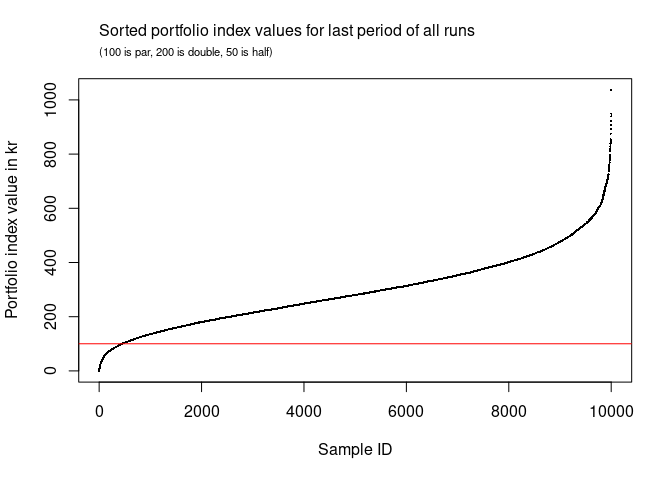<!-- -->


Use $1 - \text{p-value}$ from Lilliefors test as prior probability that the distribution is Gaussian.  
$x_{\text{obs}} = \min(x)$ and $P[\text{Event}\ |\ \text{Gaussian}] = P_{\text{Gauss}}[X \leq x_{\text{min}}]$:


|                      |   vmr|   vhr|   pmr|   phr|   mmr|   mhr| vmr_phr| vhr_pmr|
|:---------------------|-----:|-----:|-----:|-----:|-----:|-----:|-------:|-------:|
|Lillie p-val          | 0.052| 0.343| 0.024| 0.060| 0.240| 0.137|   0.375|   0.415|
|Prior prob            | 0.948| 0.657| 0.976| 0.940| 0.760| 0.863|   0.625|   0.585|
|P[Gauss &#124; Event] | 0.661| 0.223| 0.854| 0.859| 0.642| 0.844|   0.433|   0.362|


Use $1 - \text{p-value}$ from Lilliefors test as prior probability that the distribution is Gaussian.  
$x_{\text{obs}} = \max(x)$ and $P[\text{Event}\ |\ \text{Gaussian}] = P_{\text{Gauss}}[X \geq x_{\text{max}}]$:

<!-- -->


|                      |   vmr|   vhr|   pmr|   phr|   mmr|   mhr| vmr_phr| vhr_pmr|
|:---------------------|-----:|-----:|-----:|-----:|-----:|-----:|-------:|-------:|
|Lillie p-val          | 0.052| 0.343| 0.024| 0.060| 0.240| 0.137|   0.375|   0.415|
|Prior prob            | 0.948| 0.657| 0.976| 0.940| 0.760| 0.863|   0.625|   0.585|
|P[Gauss &#124; Event] | 1.000| 0.993| 0.995| 0.999| 0.984| 0.888|   0.983|   0.986|


# Velliv medium risk (vmr), 2011 - 2023


## QQ Plot

Skewed $t$-distribution (sstd):  

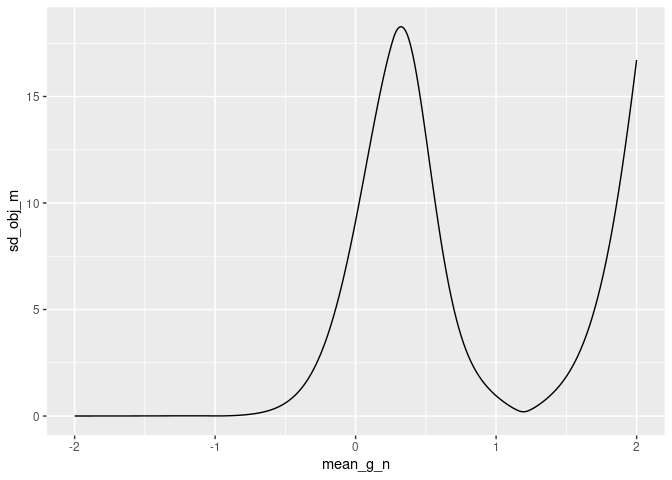<!-- -->


## Data vs fit

Let's plot the fit and the observed returns together.  

<!-- -->


## Estimated distribution

Now lets look at the CDF of the estimated distribution for each 0.1% increment between 0.5% and 99.5% for the estimated distribution:

<!-- -->


## Monte Carlo


Sorted portfolio index values for last period of all runs

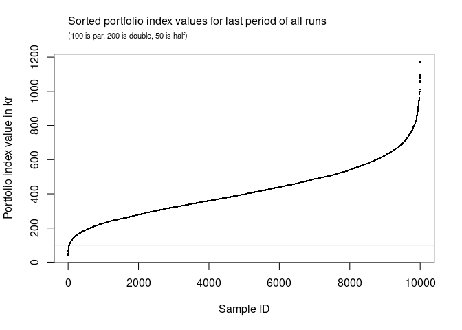<!-- -->


## Convergence

### Max vs sum

Max vs sum plots for the first four moments:

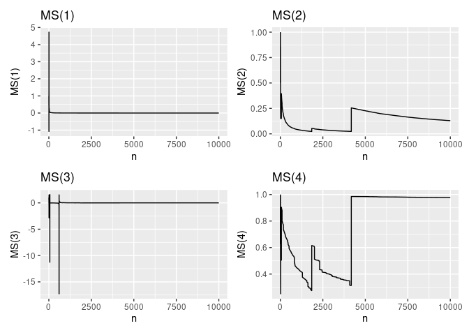<!-- -->


### MC

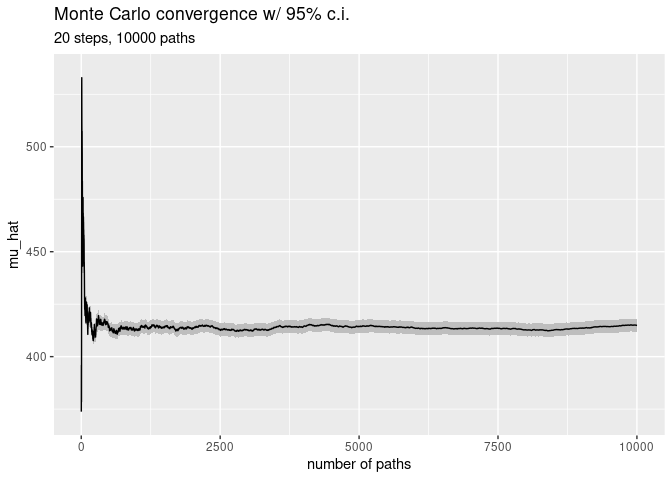<!-- -->


### IS

Skewed $t$-distribution with a normal proposal distribution.

<!-- -->

Parameters

```
## [1] 1.2294983 0.3373312
```

Objective function plots

<!-- -->


# Velliv high risk (vhr), 2011 - 2023


## QQ Plot

Skewed $t$-distribution (sstd):  

<!-- -->


## Data vs fit

Let's plot the fit and the observed returns together.  

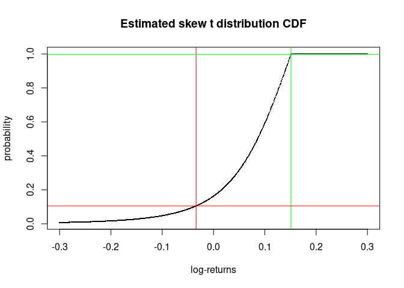<!-- -->


## Estimated distribution

Now lets look at the CDF of the estimated distribution for each 0.1% increment between 0.5% and 99.5% for the estimated distribution:

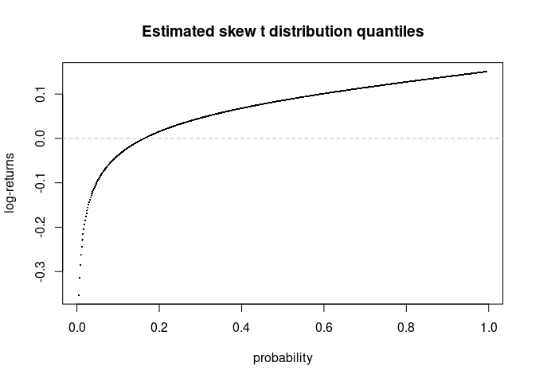<!-- -->


## Monte Carlo


Sorted portfolio index values for last period of all runs

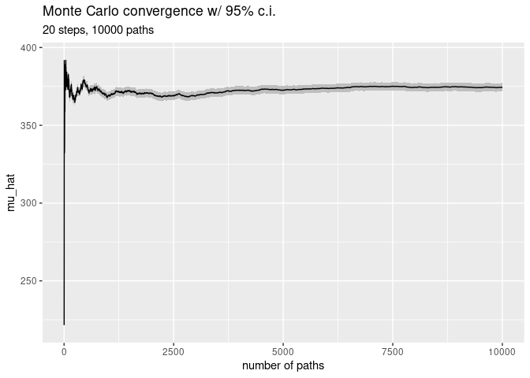<!-- -->


## Convergence

### Max vs sum

Max vs sum plots for the first four moments:

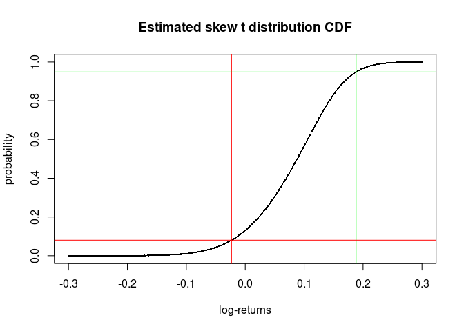<!-- -->


### MC

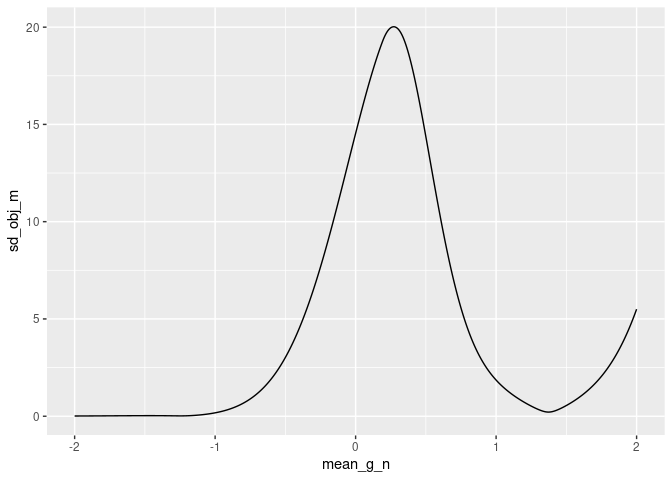<!-- -->


### IS

Skewed $t$-distribution with a normal proposal distribution.

<!-- -->

Parameters

```
## [1] 1.5074609 0.4255322
```

Objective function plots

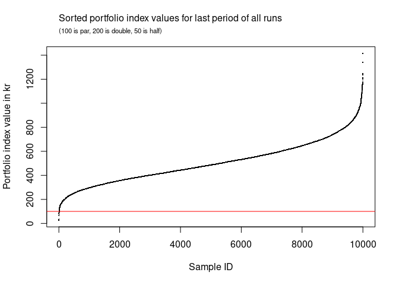<!-- -->


# PFA medium risk (pmr), 2011 - 2023


## QQ Plot

Skewed $t$-distribution (sstd):  

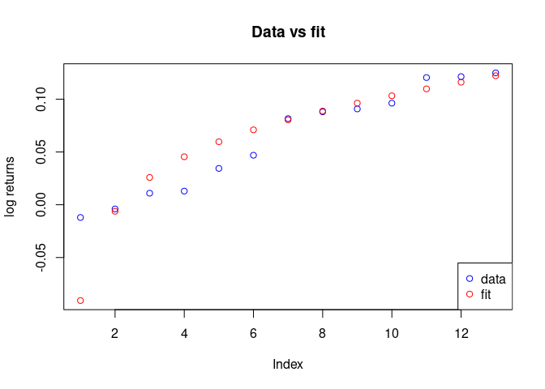<!-- -->


## Data vs fit

Let's plot the fit and the observed returns together.  

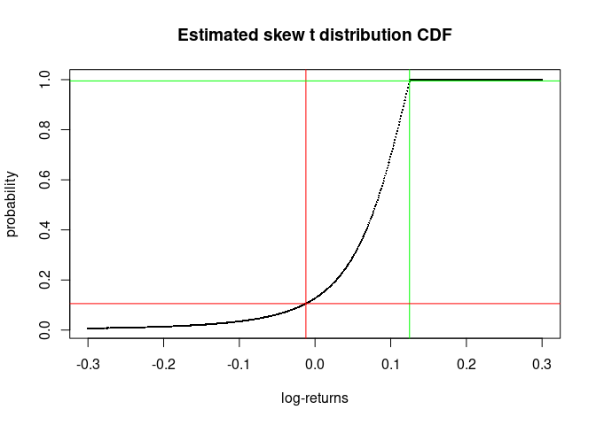<!-- -->


## Estimated distribution

Now lets look at the CDF of the estimated distribution for each 0.1% increment between 0.5% and 99.5% for the estimated distribution:

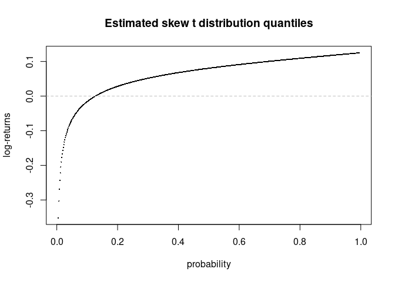<!-- -->


## Monte Carlo


pmr has the sstd fit with the lowest value of nu. Compare with other distributions:


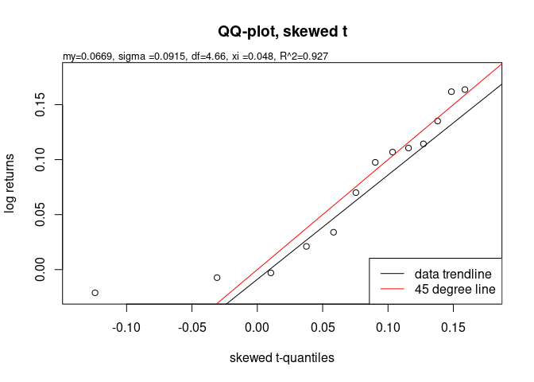<!-- -->

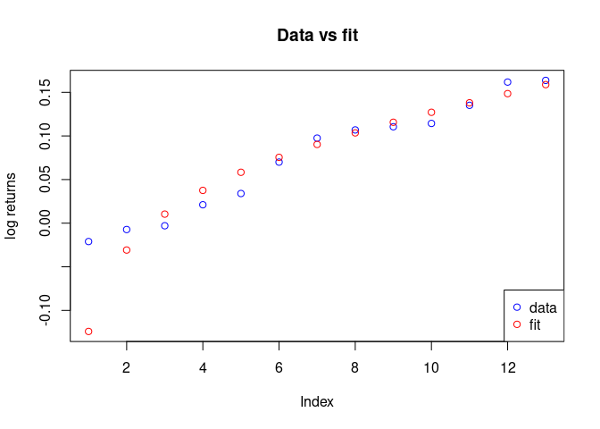<!-- -->

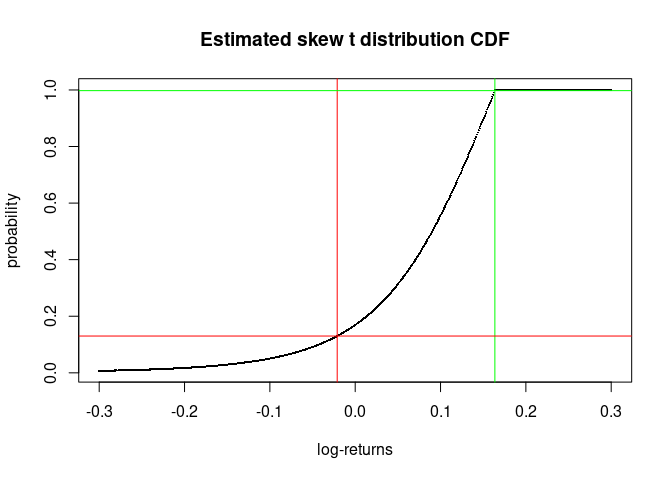<!-- -->


Sorted portfolio index values for last period of all runs

<!-- -->


## Convergence

### Max vs sum

Max vs sum plots for the first four moments:

<!-- -->


### MC

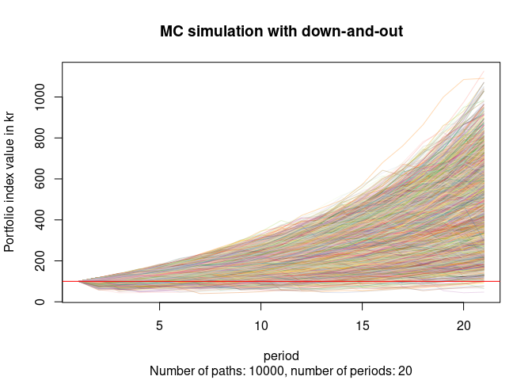<!-- -->


### IS

Skewed $t$-distribution with a normal proposal distribution.

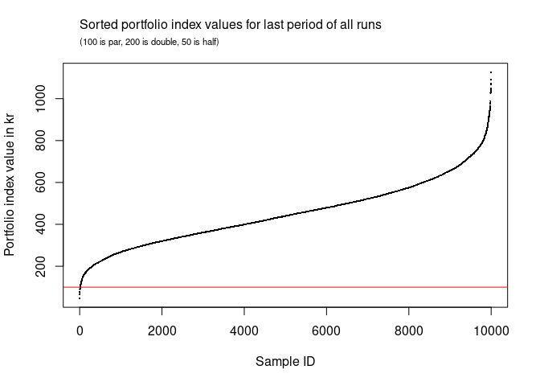<!-- -->

Parameters

```
## [1] 1.2936284 0.3062685
```

Objective function plots

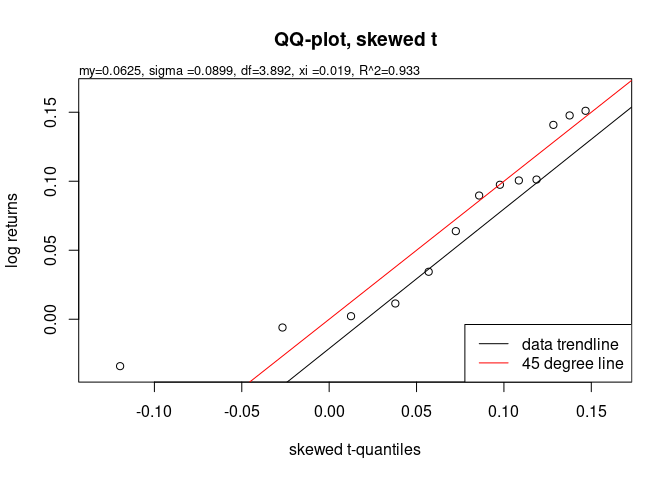<!-- -->


# PFA high risk (phr), 2011 - 2023


## QQ Plot

Skewed $t$-distribution (sstd):  

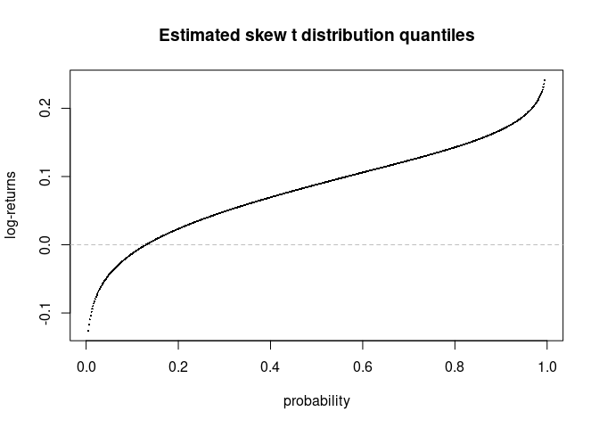<!-- -->


## Data vs fit

Let's plot the fit and the observed returns together.  

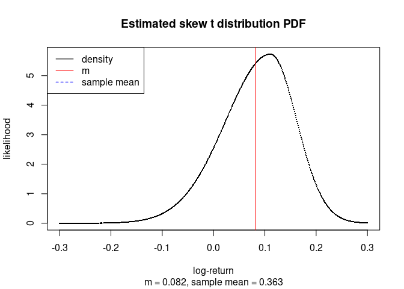<!-- -->


## Estimated distribution

Now lets look at the CDF of the estimated distribution for each 0.1% increment between 0.5% and 99.5% for the estimated distribution:

<!-- -->


## Monte Carlo


Sorted portfolio index values for last period of all runs

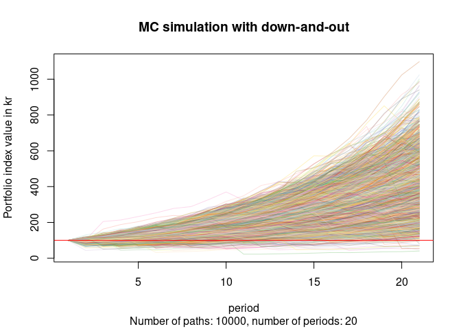<!-- -->


## Convergence

### Max vs sum

Max vs sum plots for the first four moments:

<!-- -->


### MC

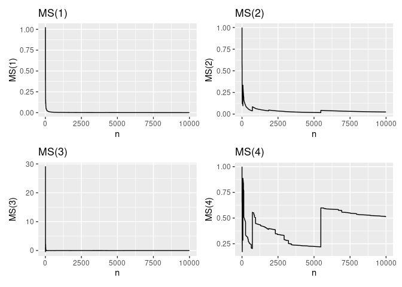<!-- -->


### IS

Skewed $t$-distribution with a normal proposal distribution.

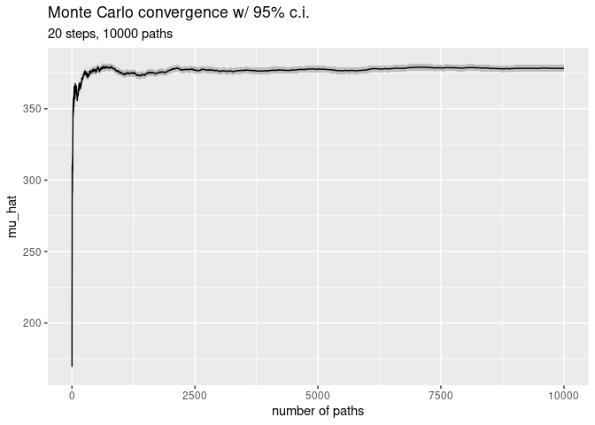<!-- -->

Parameters

```
## [1] 1.8379614 0.4397688
```

Objective function plots

<!-- -->


# Mix medium risk (mmr), 2011 - 2023


## QQ Plot

Skewed $t$-distribution (sstd):  

<!-- -->


## Data vs fit

Let's plot the fit and the observed returns together.  

<!-- -->


## Estimated distribution

Now lets look at the CDF of the estimated distribution for each 0.1% increment between 0.5% and 99.5% for the estimated distribution:

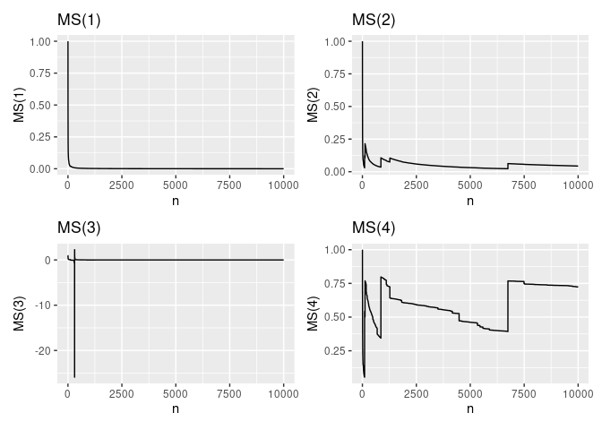<!-- -->


## Monte Carlo


Sorted portfolio index values for last period of all runs

<!-- -->


## Convergence

### Max vs sum

Max vs sum plots for the first four moments:

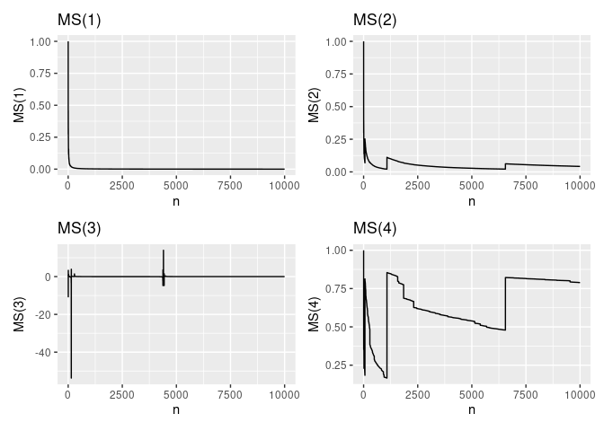<!-- -->


### MC

<!-- -->


### IS

Skewed $t$-distribution with a normal proposal distribution.

<!-- -->

Parameters

```
## [1] 1.1948623 0.2654885
```

Objective function plots

<!-- -->


# Mix high risk (mhr), 2011 - 2023


## QQ Plot

Skewed $t$-distribution (sstd):  

<!-- -->


## Data vs fit

Let's plot the fit and the observed returns together.  

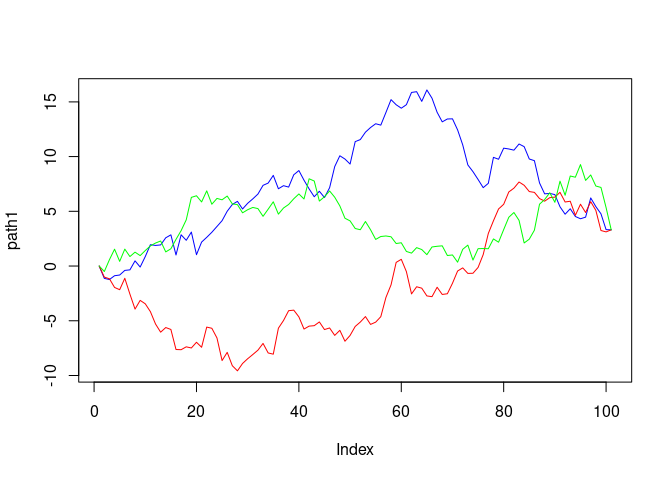<!-- -->


## Estimated distribution

Now lets look at the CDF of the estimated distribution for each 0.1% increment between 0.5% and 99.5% for the estimated distribution:

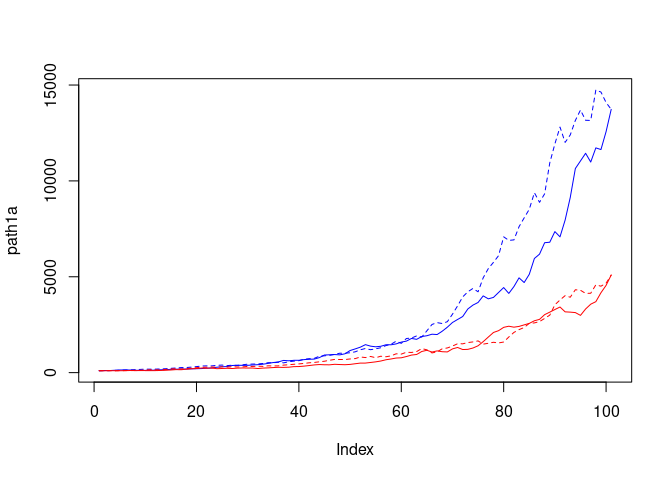<!-- -->


## Monte Carlo


mhr has the sstd fit with the highest sstd fit with thevalue of nu. Compare with other distributions:


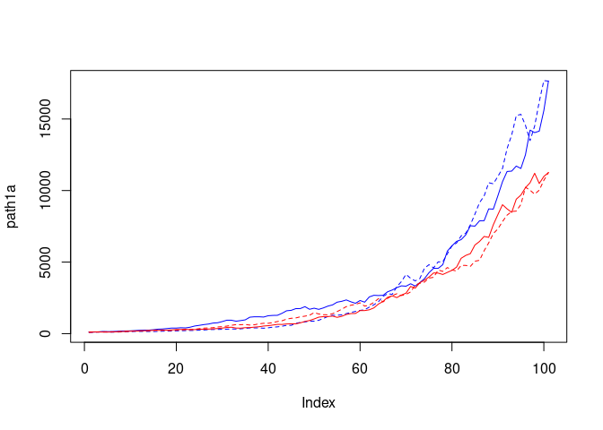<!-- -->

<!-- -->

<!-- -->


Sorted portfolio index values for last period of all runs

<!-- -->


## Convergence

### Max vs sum

Max vs sum plots for the first four moments:

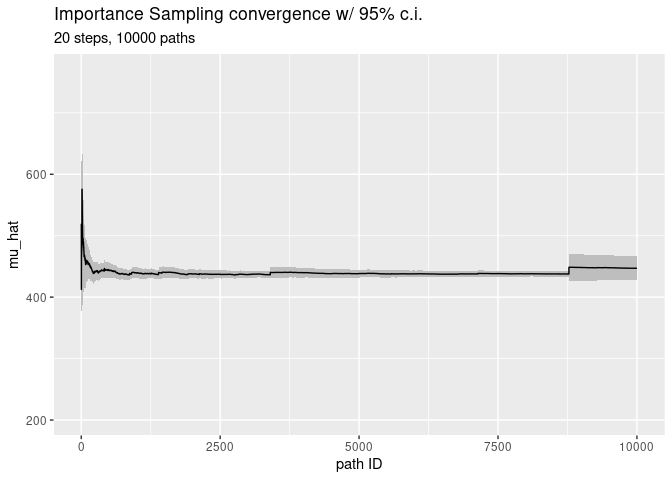<!-- -->


### MC

<!-- -->


### IS

Skewed $t$-distribution with a normal proposal distribution.

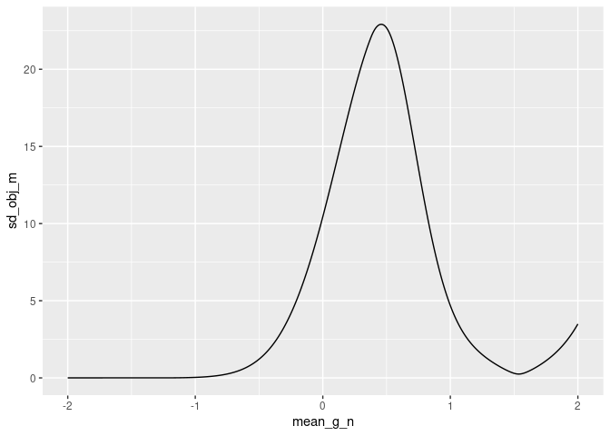<!-- -->

Parameters

```
## [1] 1.6413478 0.3380133
```

Objective function plots

<!-- -->


# Mix vmr+phr (vm_ph), 2011 - 2023


## QQ Plot

Skewed $t$-distribution (sstd):  

<!-- -->


## Data vs fit

Let's plot the fit and the observed returns together.  

<!-- -->


## Estimated distribution

Now lets look at the CDF of the estimated distribution for each 0.1% increment between 0.5% and 99.5% for the estimated distribution:

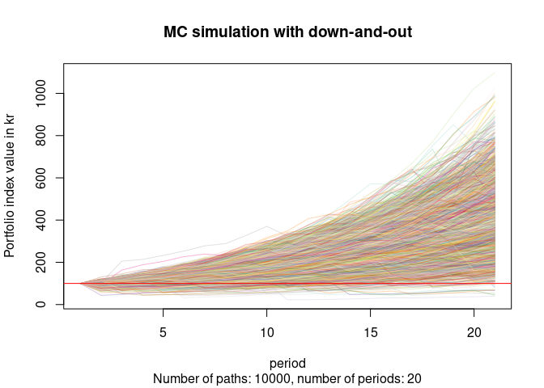<!-- -->


## Monte Carlo


Sorted portfolio index values for last period of all runs

<!-- -->


## Convergence

### Max vs sum

Max vs sum plots for the first four moments:

<!-- -->


### MC

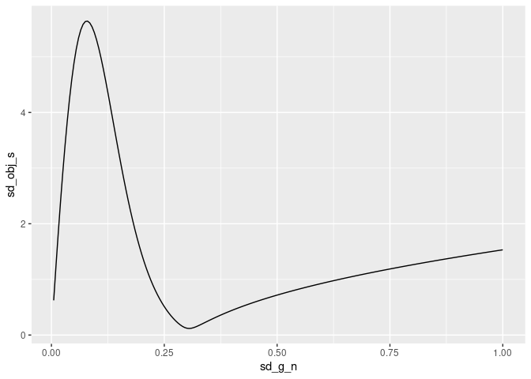<!-- -->


### IS

Skewed $t$-distribution with a normal proposal distribution.

<!-- -->

Parameters

```
## [1] 1.5363616 0.3304634
```

Objective function plots

<!-- -->


# Mix vhr+pmr (mh_pm), 2011 - 2023


## QQ Plot

Skewed $t$-distribution (sstd):  

<!-- -->


## Data vs fit

Let's plot the fit and the observed returns together.  

<!-- -->


## Estimated distribution

Now lets look at the CDF of the estimated distribution for each 0.1% increment between 0.5% and 99.5% for the estimated distribution:

<!-- -->


## Monte Carlo


Sorted portfolio index values for last period of all runs

<!-- -->


## Convergence

### Max vs sum

Max vs sum plots for the first four moments:

<!-- -->


### MC

<!-- -->


### IS

Skewed $t$-distribution with a normal proposal distribution.

<!-- -->

Parameters

```
## [1] 1.3625460 0.3050122
```

Objective function plots

<!-- -->


# Comments

`mhr` has some nice properties:  

- It has a relatively high `nu` value of 90, which means it is tending more towards exponential tails than polynomial tails. All other funds have `nu` values close to 3, except `phr` which is even worse at close to 2. (Note that for a Gaussian, `nu` is infinite.)  
- It has the lowest losing percentage of all simulations, which is better than 1/6 that of `phr`.  
- It has a DAO percentage of 0, which is the same as `mmr`, and less than `phr`.  
- Only `phr` has a higher `mc_m`.  
- It has a smaller `mc_s` than the individual components, `vhr` and `phr`.  
- It has the highest `xi` of all fits, suggesting less left skewness. Density plots for `vmr`, `phr` and `mmr` have an extremely sharp drop, as if an upward limiter has been applied, which corresponds to extremely low `xi` values. The density plot for `mhr` is by far the most symmetrical of all the fits. As seen in the section "Compare Gaussian and skewed t-distribution fits", the other skewed t-distribution fits don't capture the max observed returns at all.    
- Only `mmr` has as higher `mc_min`. However, that of `mmr` is 18 times higher with 62, so `mmr` is a clear winner here.  
- Naturally, it has a `mc_max` smaller than the individual components, `vhr` and `phr`, but ca. 1.5 times higher then `mmr`.  
- All the first 4 moments converge nicely. For all other fits, the 4th moment doesn't seem to converge.  


Taleb, Statistical Consequences Of Fat Tails, p. 97:  
"the variance of a finite variance random variable with tail exponent $< 4$ will be infinite".

And p. 363:  
"The hedging errors for an option portfolio (under a daily revision regime) over 3000 days, under a constant volatility Student T with tail exponent $\alpha = 3$. Technically the errors should not converge in finite time as their distribution has infinite variance."

- Note: QQ lines by design pass through 1st and 3rd quantiles. They are not trendlines in the sense of linear regression.  


# Appendix

## Many simulations of mc_mhr: `num_paths = 1e6`


1e6 paths:


Compare $10^6$ and $10^4$ paths for mhr:


|           |mc_m      |mc_s      |mc_min   |mc_max     |dao_pct |dai_pct |
|:----------|:---------|:---------|:--------|:----------|:-------|:-------|
|mc_mhr_1e6 |505.90695 |173.22176 |21.09569 |1734.83520 |0.00000 |0.07330 |
|mc_mhr_1e4 |505.47920 |172.23152 |51.70735 |1326.58266 |0.00000 |0.04000 |
|is_mhr_1e4 |510.836   |2331.167  |205.398  |232384.846 |ibid.   |ibid.   |


## Arithmetic vs geometric mean
Let $m$ be the number of steps in each path and $n$ be the number of paths.
$a$ is the initial capital.
Use arithmetic mean for mean of all paths at time $t$:
$$\dfrac{a (e^{z_1} + e^{z_2} + \dots + e^{z_n})}{n}$$
where
$$z_i := x_{i, 1} + x_{i, 2} + \dots + x_{i, m}$$
Use geometric mean for mean of all steps in a single path $i$:
$$a e^{\frac{x_{i, 1} + x_{i, 2} + \dots + x_{i, m}}{m}} = a \sqrt[m]{e^{x_{i, 1} + x_{i, 2} + \dots + x_{i, m}}}$$

So for **Monte Carlo** of returns after $m$ periods, we 

+ fit a skewed t-distribution to log-returns and use that distribution to simulate $\{x_{i, j}\}_j^m$,
+ for each path $i$, calculate $100\cdot e^{z_i}$,
+ calculate the mean of $\{z_i\}_i^n$:
    + $$\bar{z} = 100\dfrac{e^{z_1} + e^{z_2} + \dots + e^{z_n}}{n}$$

For **Importance Sampling**, we

+ model log-returns on a skewed t-distribution,
+ for each path $i$, calculate $100\cdot e^{z_i}$,
+ fit a skewed t-distribution to $\{z_i\}_i^n$ and use it as our $f$ density function from which we simulate $\{h_i\}_i^n$,
    + In our case $h$ and $z$ are identical, because we have an idea for a distribution to simulate $z$, but in general for IS $h$ could be a function of $z$.
+ calculate $w* = \frac{f}{g^*}$, where $g*$ is our proposal distribution, which minimizes the variance of $h\cdot w$.
+ calculate the arithmetic mean of $\{h_i w_i^{*}\}_i^n$: 
    + $$100 \dfrac{e^{h_1 w_1^{*}} +  e^{h_2 w_2^{*}} + \dots +  e^{h_n w_n^{*}}}{n}$$


## Average of returns vs returns of average

### Math

$$\text{Avg. of returns} := \dfrac{ \left(\dfrac{x_t}{x_{t-1}} + \dfrac{y_t}{y_{t-1}} \right) }{2}$$
$$\text{Returns of avg.} := \left(\dfrac{ x_t + y_t }{2}\right) \Big/ \left(\dfrac{ x_{t-1} + y_{t-1} }{2}\right) \equiv \dfrac{ x_t + y_t }{ x_{t-1} + y_{t-1}}$$

For which $x_1$ and $y_1$ are
$\text{Avg. of returns} = \text{Returns of avg.}$?

$$\dfrac{ \left(\dfrac{x_t}{x_{t-1}} + \dfrac{y_t}{y_{t-1}} \right) }{2} = \dfrac{ x_t + y_t }{ x_{t-1} + y_{t-1}}$$

$$\dfrac{x_t}{x_{t-1}} + \dfrac{y_t}{y_{t-1}} = 2 \dfrac{ x_t + y_t }{ x_{t-1} + y_{t-1}}$$

$$(x_{t-1} + y_{t-1}) x_t y_{t-1} + (x_{t-1} + y_{t-1}) x_{t-1} y_t = 2 (x_{t-1}y_{t-1}x_t + x_{t-1}y_{t-1}y_t)$$

$$(x_{t-1}x_1y_{t-1} + y_{t-1}x_ty_{t-1}) + (x_{t-1}x_{t-1}y_t + x_{t-1}y_{t-1}y_t) = 2(x_{t-1}y_{t-1}x_t + x_{t-1}y_{t-1}y_t)$$
This is not generally true, but true if for instance
$x_{t-1} = y_{t-1}$.

### Example


Definition: `R = 1+r`

```
## Let x_0 be 100.
```

```
## Let y_0 be 200.
```

```
## So the initial value of the pf is 300 .
```

```
## Let R_x be 0.5.
```

```
## Let R_y be 1.5.
```

Then,

```
## x_1 is R_x * x_0 = 50.
```

```
## y_1 is R_y * y_0 = 300.
```

Average of returns:

```
## 0.5 * (R_x + R_y) = 1
```

So here the value of the pf at t=1 should be unchanged from t=0:

```
## (x_0 + y_0) * 0.5 * (R_x + R_y) = 300
```

But this is clearly not the case:

```
## 0.5 * (x_1 + y_1) = 0.5 * (R_x * x_0 + R_y * y_0) = 175
```

Therefore we should take returns of average, not average of returns!

Let's take the average of log returns instead:

```
## 0.5 * (log(R_x) + log(R_y)) = -0.143841
```

We now get:

```
## (x_0 + y_0) * exp(0.5 * (log(Rx) + log(Ry))) = 259.8076
```

So taking the average of log returns doesn't work either.

## Simulation of mix vs mix of simulations

Test if a simulation of a mix (average) of two returns series has the
same distribution as a mix of two simulated returns series.

```
## m(data_x): 0.004571526 
## s(data_x): 0.3121485 
## m(data_y): 9.708343 
## s(data_y): 3.750817 
## 
## m(data_x + data_y): 4.856457 
## s(data_x + data_y): 1.915542
```

m and s of final state of all paths.\
`_a` is mix of simulated returns.\
`_b` is simulated mixed returns.


|    m_a|    m_b|   s_a|   s_b|
|------:|------:|-----:|-----:|
| 96.651| 97.156| 8.841| 8.566|
| 97.483| 96.975| 8.447| 8.428|
| 97.201| 97.387| 8.546| 8.334|
| 97.203| 96.924| 8.224| 8.387|
| 96.547| 97.011| 8.598| 8.531|
| 96.934| 96.717| 8.604| 8.643|
| 96.941| 97.129| 8.449| 8.182|
| 96.970| 96.734| 8.032| 8.169|
| 96.729| 97.186| 8.820| 8.708|
| 97.022| 97.063| 8.457| 8.718|

```
##       m_a             m_b             s_a             s_b       
##  Min.   :96.55   Min.   :96.72   Min.   :8.032   Min.   :8.169  
##  1st Qu.:96.78   1st Qu.:96.94   1st Qu.:8.447   1st Qu.:8.347  
##  Median :96.96   Median :97.04   Median :8.501   Median :8.480  
##  Mean   :96.97   Mean   :97.03   Mean   :8.502   Mean   :8.467  
##  3rd Qu.:97.16   3rd Qu.:97.15   3rd Qu.:8.602   3rd Qu.:8.624  
##  Max.   :97.48   Max.   :97.39   Max.   :8.841   Max.   :8.718
```

`_a` and `_b` are very close to equal.\
We attribute the differences to differences in estimating the
distributions in version a and b.

The final state is independent of the order of the preceding steps:

<!-- -->

So does the order of the steps in the two processes matter, when mixing
simulated returns?

<!-- -->

<!-- -->

The order of steps in the individual paths do not matter, because the
mix of simulated paths is a sum of a sum, so the order of terms doesn't
affect the sum. If there is variation it is because the sets preceding
steps are not the same. For instance, the steps between step 1 and 60 in
the plot above are not the same for the two lines.

Recall,
$$\text{Var}(aX+bY) = a^2 \text{Var}(X) + b^2 \text{Var}(Y) + 2ab \text{Cov}(a, b)$$

```r
var(0.5 * vhr + 0.5 * phr)
```

```
## [1] 0.005355618
```

```r
0.5^2 * var(vhr) + 0.5^2 * var(phr) + 2 * 0.5 * 0.5 * cov(vhr, phr)
```

```
## [1] 0.005355618
```

Our distribution estimate is based on 13 observations. Is that enough
for a robust estimate? What if we suddenly hit a year like 2008? How
would that affect our estimate?\
Let's try to include the Velliv data from 2007-2010.\
We do this by sampling 13 observations from `vmrl`.

```
##        m                 s          
##  Min.   :0.06102   Min.   :0.05019  
##  1st Qu.:0.06578   1st Qu.:0.06022  
##  Median :0.06823   Median :0.06828  
##  Mean   :0.07025   Mean   :0.06875  
##  3rd Qu.:0.07273   3rd Qu.:0.07507  
##  Max.   :0.08403   Max.   :0.09132
```

## The meaning of `xi`

The fit for `mhr` has the highest `xi` value of all. This suggests
right-skew:

<!-- -->

## Max vs sum plot

If the Law Of Large Numbers holds true,
$$\dfrac{\max (X_1^p, ..., X^p)}{\sum_{i=1}^n X_i^p} \rightarrow 0$$ for
$n \rightarrow \infty$.

If not, $X$ doesn't have a $p$'th moment.

See Taleb: The Statistical Consequences Of Fat Tails, p. 192


