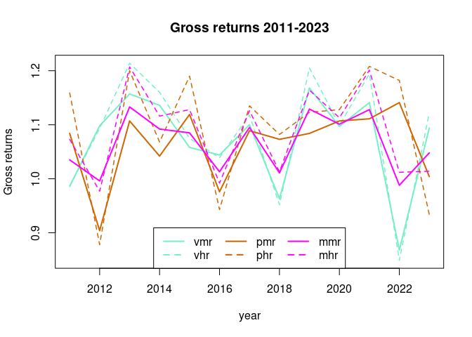

Fit log returns to F-S skew standardized Student-t distribution.  
`m`  is the location parameter.  
`s` is the scale parameter.  
`nu` is the estimated shape parameter (degrees of freedom).  
`xi` is the estimated skewness parameter.  

# Log returns data 2011-2023.  
For 2011, medium risk data is used in the high risk data set, as no high risk fund data is available prior to 2012.  
`vmrl` is a long version of Velliv medium risk data, from 2007 to 2023. For 2007 to 2011 (both included) no high risk data is available.


<!-- -->


## Summary of gross returns


```
##       vmr             vhr             pmr             phr       
##  Min.   :0.868   Min.   :0.849   Min.   :0.904   Min.   :0.878  
##  1st Qu.:1.044   1st Qu.:1.039   1st Qu.:1.042   1st Qu.:1.068  
##  Median :1.097   Median :1.099   Median :1.084   Median :1.128  
##  Mean   :1.070   Mean   :1.085   Mean   :1.065   Mean   :1.095  
##  3rd Qu.:1.136   3rd Qu.:1.160   3rd Qu.:1.107   3rd Qu.:1.182  
##  Max.   :1.168   Max.   :1.214   Max.   :1.141   Max.   :1.208  
##       mmr             mhr           vm_ph_r          vh_pm_r      
##  Min.   :0.988   Min.   :0.977   Min.   :0.9791   Min.   :0.9666  
##  1st Qu.:1.013   1st Qu.:1.013   1st Qu.:1.0213   1st Qu.:1.0115  
##  Median :1.085   Median :1.113   Median :1.1024   Median :1.0938  
##  Mean   :1.066   Mean   :1.087   Mean   :1.0807   Mean   :1.0736  
##  3rd Qu.:1.101   3rd Qu.:1.128   3rd Qu.:1.1211   3rd Qu.:1.1065  
##  Max.   :1.133   Max.   :1.207   Max.   :1.1778   Max.   :1.1630
```


```
##       vmrl      
##  Min.   :0.801  
##  1st Qu.:1.013  
##  Median :1.085  
##  Mean   :1.061  
##  3rd Qu.:1.128  
##  Max.   :1.193
```


```
##            vmr   vhr   pmr   phr   mmr   mhr vm_ph_r vh_pm_r
## Min.   : 0.868 0.849 0.904 0.878 0.988 0.977  0.9791  0.9666
## 1st Qu.: 1.044 1.039 1.042 1.068 1.013 1.013  1.0213  1.0115
## Median : 1.097 1.099 1.084 1.128 1.085 1.113  1.1024  1.0938
## Mean   : 1.070 1.085 1.065 1.095 1.066 1.087  1.0807  1.0736
## 3rd Qu.: 1.136 1.160 1.107 1.182 1.101 1.128  1.1211  1.1065
## Max.   : 1.168 1.214 1.141 1.208 1.133 1.207  1.1778  1.1630
```

## Ranking

| Min.   :|ranking | 1st Qu.:|ranking | Median :|ranking | Mean   :|ranking | 3rd Qu.:|ranking | Max.   :|ranking |
|--------:|:-------|--------:|:-------|--------:|:-------|--------:|:-------|--------:|:-------|--------:|:-------|
|    0.988|mmr     |    1.068|phr     |    1.128|phr     |    1.095|phr     |    1.182|phr     |    1.214|vhr     |
|    0.979|vm_ph_r |    1.044|vmr     |    1.113|mhr     |    1.087|mhr     |    1.160|vhr     |    1.208|phr     |
|    0.977|mhr     |    1.042|pmr     |    1.102|vm_ph_r |    1.085|vhr     |    1.136|vmr     |    1.207|mhr     |
|    0.967|vh_pm_r |    1.039|vhr     |    1.099|vhr     |    1.081|vm_ph_r |    1.128|mhr     |    1.178|vm_ph_r |
|    0.904|pmr     |    1.021|vm_ph_r |    1.097|vmr     |    1.074|vh_pm_r |    1.121|vm_ph_r |    1.168|vmr     |
|    0.878|phr     |    1.013|mmr     |    1.094|vh_pm_r |    1.070|vmr     |    1.107|pmr     |    1.163|vh_pm_r |
|    0.868|vmr     |    1.013|mhr     |    1.085|mmr     |    1.066|mmr     |    1.106|vh_pm_r |    1.141|pmr     |
|    0.849|vhr     |    1.012|vh_pm_r |    1.084|pmr     |    1.065|pmr     |    1.101|mmr     |    1.133|mmr     |

## Covariance and correlations


Covariances

```
##         vmr     vhr     pmr     phr
## vmr  0.0072  0.0087 -0.0011 -0.0008
## vhr  0.0087  0.0106 -0.0008 -0.0002
## pmr -0.0011 -0.0008  0.0043  0.0066
## phr -0.0008 -0.0002  0.0066  0.0111
```

Correlations

```
##         vmr     vhr     pmr     phr
## vmr  1.0000  0.9926 -0.1971 -0.0949
## vhr  0.9926  1.0000 -0.1186 -0.0159
## pmr -0.1971 -0.1186  1.0000  0.9569
## phr -0.0949 -0.0159  0.9569  1.0000
```
`vhr` and `phr` are clearly the least correlated.


This is the data for "vmr":

```
##            vmr
## 1  -0.01409892
## 2   0.09349034
## 3   0.14583045
## 4   0.12751332
## 5   0.05638033
## 6   0.04305949
## 7   0.09531018
## 8  -0.03770187
## 9   0.15529288
## 10  0.09257918
## 11  0.13190507
## 12 -0.14156356
## 13  0.08984070
```


This is the data for "vhr":

```
##            vhr
## 1  -0.01409892
## 2   0.08892621
## 3   0.19392069
## 4   0.14842001
## 5   0.07232066
## 6   0.03825871
## 7   0.11154137
## 8  -0.04919024
## 9   0.18647957
## 10  0.09440068
## 11  0.17730901
## 12 -0.16369609
## 13  0.11511281
```


This is the data for "pmr":

```
##             pmr
## 1   0.080657903
## 2  -0.100925919
## 3   0.101653654
## 4   0.041141943
## 5   0.112435429
## 6  -0.024292693
## 7   0.085259844
## 8   0.070458464
## 9   0.080657903
## 10  0.101653654
## 11  0.105260511
## 12  0.131905071
## 13  0.003992021
```


This is the data for "phr":

```
##            phr
## 1   0.14755756
## 2  -0.13010869
## 3   0.18232156
## 4   0.06578774
## 5   0.17395331
## 6  -0.05868900
## 7   0.12663265
## 8   0.07881118
## 9   0.11600368
## 10  0.12044615
## 11  0.18896610
## 12  0.16720792
## 13 -0.06827884
```


This is the data for "mmr":

```
##             mmr
## 1   0.034401427
## 2  -0.004008021
## 3   0.124868982
## 4   0.088010877
## 5   0.081579987
## 6   0.012916225
## 7   0.090754363
## 8   0.010939940
## 9   0.121332285
## 10  0.096218858
## 11  0.120446153
## 12 -0.012072581
## 13  0.046883586
```


This is the data for "mhr":

```
##             mhr
## 1   0.070458464
## 2  -0.023268627
## 3   0.188137942
## 4   0.109750864
## 5   0.120446153
## 6  -0.008032172
## 7   0.118671530
## 8   0.012916225
## 9   0.151862349
## 10  0.107059072
## 11  0.183154543
## 12  0.011928571
## 13  0.013902905
```


This is the data for "vm_ph_r":

```
##         vm_ph_r
## 1   0.069992372
## 2  -0.021092690
## 3   0.163677439
## 4   0.097519239
## 5   0.114332627
## 6  -0.007293975
## 7   0.110535440
## 8   0.021085397
## 9   0.135090164
## 10  0.106868774
## 11  0.161769625
## 12  0.033990389
## 13 -0.002978343
```


This is the data for "vh_pm_r":

```
##         vh_pm_r
## 1   0.034401427
## 2  -0.005991828
## 3   0.151038887
## 4   0.101211891
## 5   0.089641599
## 6   0.011421798
## 7   0.100550734
## 8   0.002211811
## 9   0.140838876
## 10  0.097441395
## 11  0.147669719
## 12 -0.033989745
## 13  0.063828942
```


